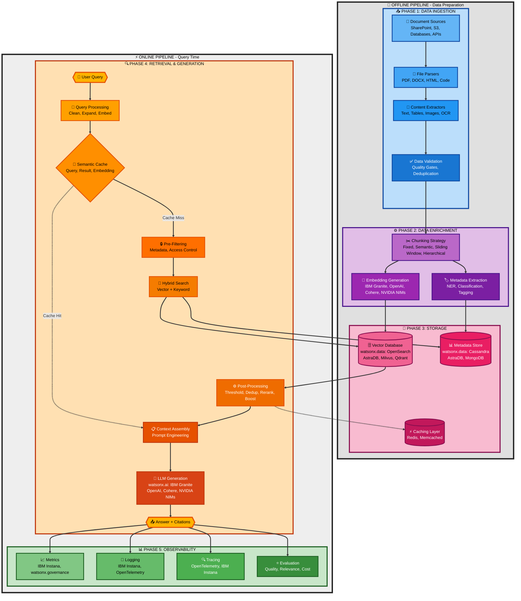
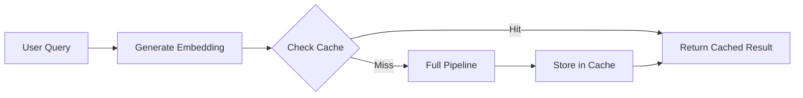
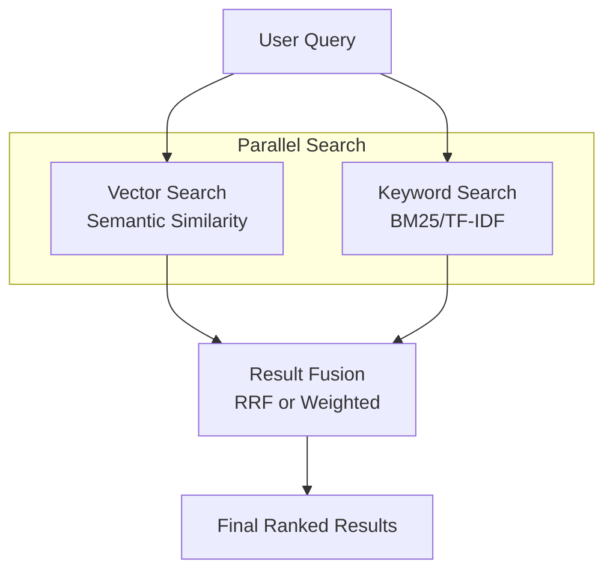
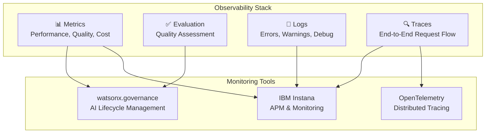

# Enterprise RAG: Complete Architecture Guide

> **TL;DR**: A comprehensive technical guide for implementing production-ready RAG systems, covering the complete pipeline from data ingestion to monitoring. Includes reference architecture, best practices, and IBM watsonx.data integration patterns.

---

## Table of Contents

1. [Introduction](#-introduction)
2. [Enterprise RAG Use Cases](#-enterprise-rag-use-cases)
3. [RAG Reference Architecture](#️-rag-reference-architecture)
4. [Phase 1: Data Ingestion](#-phase-1-data-ingestion)
5. [Phase 2: Data Enrichment](#️-phase-2-data-enrichment)
6. [Phase 3: Storage Architecture](#-phase-3-storage-architecture)
7. [Phase 4: Retrieval & Generation Pipeline](#-phase-4-retrieval--generation-pipeline)
8. [Phase 5: Observability & Monitoring](#-phase-5-observability--monitoring)
9. [Technology Stack Recommendation](#️-technology-stack-recommendation)

---

## 📖 Introduction

This comprehensive guide provides detailed technical architecture for implementing production-ready RAG systems in enterprise environments, covering the complete pipeline from data ingestion to monitoring and observability.

### Prerequisites

**📚 Start with Why RAG?** - Before diving into implementation details, ensure you understand the foundational concepts by reading **[Why RAG?](Why_RAG.md)**, which covers:
- Traditional search limitations and business impact
- LLM-only approach risks and challenges
- What RAG is and how it solves both problems
- Key benefits and comparison with other approaches
- High-level RAG system architecture

This guide assumes familiarity with those concepts and focuses exclusively on the "how" - providing detailed implementation architecture, best practices, and technology recommendations.

---

## 🏗️ RAG Reference Architecture

The RAG architecture can be organized into multiple phases, each with specific responsibilities and technologies. For this guide, we break it down into five key phases that cover the complete lifecycle from data ingestion to production monitoring.

### Complete Pipeline Architecture



### Architecture Overview

The architecture operates through two distinct pipelines: an **offline pipeline** optimized for quality and completeness (runs periodically, batch processing), and an **online pipeline** optimized for speed and user experience (real-time processing with caching). This separation enables independent scaling, different optimization goals, and flexible updates without affecting online performance.

**OFFLINE PIPELINE - Data Preparation:**

**PHASE 1: DATA INGESTION**
- Document Sources (SharePoint, Object Stores, Databases, APIs)
- File Parsers & Content Extractors (PDF, DOCX, HTML, Text, Tables, Images)
- Data Validation & Deduplication

**PHASE 2: DATA ENRICHMENT**
- Chunking Strategy (Fixed, Semantic, Sliding Window, Hierarchical)
- Embedding Generation (watsonx.ai: IBM Granite, OpenAI, Cohere, NVIDIA NIMs)
- Metadata Extraction (NER, Classification, Tagging)

**PHASE 3: STORAGE**
- Vector Database (watsonx.data: OpenSearch, AstraDB, Milvus, Qdrant)
- Metadata Store (watsonx.data: Cassandra, AstraDB, MongoDB)
- Caching Layer (Redis, Memcached)

**ONLINE PIPELINE - Query Time:**

**PHASE 4: RETRIEVAL & GENERATION**
- Query Processing (Clean, Expand, Embed)
- Semantic Caching (Query, Result, Embedding Cache)
- Pre-Filtering (Metadata, Access Control)
- Hybrid Search (Vector + Keyword)
- Post-Retrieval Processing (Threshold, Deduplication, Reranking, Boosting)
- Context Assembly & Prompt Engineering
- LLM Generation (watsonx.ai: IBM Granite, OpenAI, Cohere, NVIDIA NIMs)

**PHASE 5: OBSERVABILITY**
- Metrics (IBM Instana, watsonx.governance)
- Logging (IBM Instana, OpenTelemetry)
- Tracing (OpenTelemetry, IBM Instana)
- Evaluation (Quality, Relevance, Cost)

This cloud-agnostic architecture can be deployed on any platform, with each phase independently scalable based on workload requirements.

---

## 📥 Phase 1: Data Ingestion

### Purpose

> **🎯 Goal**: Acquire and prepare raw documents from various enterprise sources, ensuring data quality and consistency before enrichment.

### 1. Document Sources

Connect to wherever your enterprise data lives:

**Storage Systems:**
- **File systems**: Local, network, distributed file systems
- **Cloud storage**: S3, Azure Blob Storage, Google Cloud Storage
- **Object stores**: MinIO, Ceph, enterprise storage solutions

**Enterprise Systems:**
- **SharePoint, Confluence, Notion, Jira**: Collaborative platforms
- **Databases**: SQL, NoSQL, data warehouses
- **APIs**: REST, GraphQL, custom integrations
- **Email systems**: Exchange, Gmail, custom mail servers

### 2. File Parsers & Content Extractors

Different formats require specialized parsing strategies to extract meaningful content:

**Document Formats:**
- **PDF**: Complex layouts, tables, multi-column, scanned images
- **Office documents**: DOCX, XLSX, PPTX with structured content
- **Web content**: HTML, Markdown with proper structure preservation
- **Code files**: Syntax-aware parsing for programming languages
- **Specialized formats**: CAD, scientific data, proprietary formats

**Content Extraction:**
- **Text extraction**: Primary content with structure preservation
- **Table detection and parsing**: Structured data extraction
- **Image extraction and OCR**: Visual content and scanned documents
- **Metadata extraction**: Document properties and attributes

**Technologies:**
- **[docling.ai](https://ds4sd.github.io/docling/)**: Advanced document understanding and parsing
- **[Apache Tika](https://tika.apache.org/)**: Universal document parser supporting 1000+ formats
- **[PyPDF2](https://pypdf2.readthedocs.io/)**: Python PDF parsing library
- **[Unstructured.io](https://unstructured.io/)**: Modern document parsing with ML-based extraction

### 3. Data Validation & Deduplication

> **⚡ Critical**: Prevent bad data from entering the system through comprehensive quality gates:

**Validation & Quality Gates:**
- **File integrity checks**: Detect corrupted or incomplete files
- **Format validation**: Ensure parsers can handle the file type
- **Content quality assessment**: Filter out low-quality or empty content (minimum length, coherence, completeness)
- **Virus/malware scanning**: Security best practice for uploaded content
- **Encoding validation**: Ensure proper UTF-8 encoding to prevent downstream issues
- **Language detection**: Filter or route content based on language requirements
- **PII/sensitive data detection**: Flag or redact personally identifiable information for compliance (GDPR, HIPAA)
- **Content policy checks**: Validate against organizational content policies and regulatory requirements

**Deduplication:**
- **Content-based hashing**: Use MD5/SHA256 for exact duplicate detection
- **Fuzzy matching**: Detect near-duplicates and different versions of same document
- **Version control**: Keep latest version, archive or discard older versions
- **Cross-source deduplication**: Identify same content from multiple sources

**Normalization:**
- **Character encoding (UTF-8)**: Prevent encoding issues across systems
- **Date format standardization**: Enable date-based filtering and sorting
- **Text cleaning**: Remove parsing artifacts and formatting issues
- **Language standardization**: Enable language-specific processing

**Metadata Enrichment:**
- **Extract structured metadata**: Document properties for filtering
- **Classify document types**: Route to appropriate processing pipelines
- **Identify sensitive information**: GDPR, CCPA compliance
- **Apply business rules**: Retention policies, access controls

### Real-Time Data Integration

While the offline pipeline typically processes data in batches, modern RAG systems often require real-time or near-real-time data updates to ensure information freshness. This complements batch ingestion, allowing you to balance thoroughness (batch) with freshness (streaming).

**Streaming Ingestion:**
- **[Confluent Kafka](https://www.confluent.io/) (via [watsonx.data](https://www.ibm.com/products/watsonx-data))**: Stream real-time data updates into your RAG pipeline
- **Change Data Capture (CDC)**: Automatically detect and ingest changes from source systems
- **Event-Driven Architecture**: Trigger processing pipelines based on data events

**Benefits:**
- Keep embeddings synchronized with source systems without full reprocessing
- Reduce latency between data updates and search availability
- Enable incremental updates for cost efficiency
- Support use cases requiring up-to-date information (news, pricing, inventory)

**Implementation Pattern:**
```
Source System → Kafka Topic → Stream Processor → Validation →
Enrichment Pipeline → Vector DB Update
```

**Considerations:**
- Balance between batch reprocessing and incremental streaming updates
- Implement proper ordering and deduplication for streaming data
- Monitor lag and throughput for streaming pipelines
- Handle schema evolution and backward compatibility
- Consider platforms with query federation (e.g., [watsonx.data](https://www.ibm.com/products/watsonx-data)) to unify access to both streaming and batch data sources

### Best Practices

- Implement quality gates early to prevent wasting resources on bad data
- Use tiered validation (fast checks first, expensive checks later)
- Log all processing steps and validation failures for debugging and audit
- Monitor processing metrics (throughput, error rates, latency, validation pass rates)
- Handle failures gracefully with retries and dead-letter queues
- Balance validation strictness with data coverage needs
- Version control for processing logic and configurations
- Consider incremental updates vs full reprocessing based on data freshness requirements
- Implement circuit breakers for external dependencies

---

## ⚙️ Phase 2: Data Enrichment

Data enrichment transforms raw documents into searchable, semantically meaningful chunks with embeddings and metadata.

### Chunking Strategies

#### Why Chunking?

Documents are typically too large to process as single units. Chunking breaks them into smaller, semantically coherent pieces that:
- Fit within LLM context windows
- Improve retrieval precision
- Enable more relevant context assembly
- Reduce processing costs

#### Strategy Options

**1. Fixed-Size Chunking**
- Split by character count or token count
- Simple and predictable
- May break semantic boundaries
- Good for: Uniform content, initial prototypes

**2. Semantic Chunking**
- Split based on meaning and topic boundaries
- Preserves context and coherence
- More complex to implement
- Good for: Narrative content, articles, documentation

**3. Sliding Window**
- Overlapping chunks for context continuity
- Prevents information loss at boundaries
- Increases storage requirements
- Good for: Technical documentation, legal documents

**4. Hierarchical Chunking**
- Multi-level chunks (document → section → paragraph)
- Enables coarse-to-fine retrieval
- Most complex but most powerful
- Good for: Structured documents, books, manuals

#### Recommended Approach

> **✅ Best Practice**: Start with **semantic chunking with sliding window overlap**:
> - **Chunk size**: 512-1024 tokens (balance between context and precision)
> - **Overlap**: 10-20% (typically 50-200 tokens)
> - **Boundaries**: Respect natural boundaries (paragraphs, sections, sentences)
> - **Metadata**: Preserve document structure in metadata

### Embedding Generation

#### What are Embeddings?

Embeddings are dense vector representations of text that capture semantic meaning. Similar concepts have similar vectors, enabling semantic search beyond keyword matching.

#### Key Considerations

- **Dimensionality**: Higher dimensions (768-1536) capture more nuance but increase storage and compute
- **Model selection**: Balance between quality, speed, and cost
- **Consistency**: Use same embedding model for indexing and querying
- **Batch processing**: Generate embeddings in batches for efficiency
- **Caching**: Cache embeddings to avoid regeneration

#### Model Options

**Open Source:**
- **[sentence-transformers](https://www.sbert.net/)**: Popular, well-maintained, good quality
- **[IBM Granite Embeddings](https://www.ibm.com/products/watsonx-ai/foundation-models)**: Enterprise-optimized, multilingual support
- **[NVIDIA NIMs](https://www.nvidia.com/en-us/ai/)**: Optimized inference performance

**Commercial:**
- **[OpenAI text-embedding-ada-002](https://platform.openai.com/docs/guides/embeddings)**: High quality, cost-effective
- **[Cohere embed-english-v3.0](https://cohere.com/embeddings)**: Strong performance, flexible
- **[Voyage AI](https://www.voyageai.com/)**: Specialized for retrieval tasks

#### Best Practices

> **💡 Pro Tips**:
> - Benchmark multiple models on your specific data
> - Consider domain-specific fine-tuned models for specialized content
- Monitor embedding quality with similarity metrics
- Version embeddings when changing models
- Implement fallback strategies for embedding generation failures
- Use appropriate batch sizes to optimize throughput
- Consider cost vs quality tradeoffs for production scale

### Metadata Extraction

#### Why Metadata Matters

Metadata enables:
- **Pre-filtering**: Narrow search space before vector search
- **Access control**: Enforce permissions at query time
- **Faceted search**: Enable filtering by attributes
- **Boosting**: Prioritize results based on metadata
- **Analytics**: Track usage patterns and content gaps

#### Metadata Types

**Document-level:**
- Source, author, creation/modification dates
- Document type, format, language
- Security classification, access permissions
- Business unit, department, project

**Content-level:**
- Named entities (people, organizations, locations)
- Topics and categories
- Sentiment and tone
- Key phrases and concepts

#### Extraction Techniques

**Rule-based:**
- Regular expressions for structured patterns
- Document property extraction
- File system metadata

**ML-based:**
- Named Entity Recognition (NER)
- Topic modeling
- Classification models
- Custom extractors for domain-specific metadata

#### Best Practices

- Extract metadata at ingestion time, not query time
- Store metadata in structured format for efficient filtering
- Index frequently-used metadata fields
- Validate metadata quality and completeness
- Use hierarchical metadata for flexible filtering
- Consider privacy implications of extracted metadata
- Version metadata schemas for evolution

---

## 💾 Phase 3: Storage Architecture

The storage layer is critical for RAG performance, scalability, and cost-efficiency.

### Storage Components

#### 1. Vector Database

Stores embeddings and enables fast similarity search.

**Key Requirements:**
- **Approximate Nearest Neighbor (ANN) search**: Fast similarity search at scale
- **Metadata filtering**: Pre-filter before vector search
- **Horizontal scalability**: Handle growing data volumes
- **High availability**: Production-grade reliability
- **Performance**: Sub-100ms query latency

**Popular Options:**
- **[OpenSearch](https://opensearch.org/)** (via [watsonx.data](https://www.ibm.com/products/watsonx-data)): Full-text + vector search, mature ecosystem
- **[AstraDB](https://www.datastax.com/products/datastax-astra)** (via [watsonx.data](https://www.ibm.com/products/watsonx-data)): Managed Cassandra with vector support
- **[Milvus](https://milvus.io/)** (via [watsonx.data](https://www.ibm.com/products/watsonx-data)): Purpose-built for vectors, high performance
- **[Qdrant](https://qdrant.tech/)** (via [watsonx.data](https://www.ibm.com/products/watsonx-data)): Developer-friendly, good performance

#### 2. Metadata Store

Stores structured metadata for filtering and analytics.

**Requirements:**
- Fast filtering and aggregation
- Flexible schema for evolving metadata
- Integration with vector database
- Support for complex queries

**Options:**
- **[Cassandra](https://cassandra.apache.org/)/[AstraDB](https://www.datastax.com/products/datastax-astra)** (via [watsonx.data](https://www.ibm.com/products/watsonx-data)): Scalable, distributed
- **[MongoDB](https://www.mongodb.com/)** (via [watsonx.data](https://www.ibm.com/products/watsonx-data)): Flexible schema, rich queries
- **[PostgreSQL](https://www.postgresql.org/)**: ACID compliance, mature tooling

#### 3. Caching Layer

Reduces latency and costs by caching frequent queries and results.

**Cache Types:**
- **Query cache**: Store query → results mappings
- **Embedding cache**: Cache query embeddings
- **Result cache**: Cache LLM responses
- **Semantic cache**: Match similar queries

**Technologies:**
- **[Redis](https://redis.io/)**: Fast, feature-rich, widely adopted
- **[Memcached](https://memcached.org/)**: Simple, high-performance

### Architecture Patterns

**Pattern 1: Unified Storage (Recommended for watsonx.data)**
```
watsonx.data Lakehouse
├── Vector Search (OpenSearch/Milvus)
├── Metadata Store (Cassandra/AstraDB)
├── Object Storage (S3-compatible)
└── Streaming (Kafka)
```

**Pattern 2: Separate Specialized Stores**
```
Vector DB (Milvus) + Metadata DB (PostgreSQL) + Cache (Redis)
Note: Requires custom integration layer for query federation across stores
```

**Pattern 3: Hybrid Approach**
```
Primary: watsonx.data
Cache Layer: Redis
CDN: For static assets
```

### Best Practices

- Choose storage based on scale, performance, and operational requirements
- Implement proper indexing strategies for metadata
- Monitor storage performance and costs
- Plan for data growth and scaling
- Implement backup and disaster recovery
- Use connection pooling for database efficiency
- Consider data locality for multi-region deployments
- Implement proper security and access controls
- Implement unified governance across all data sources (consider platforms with built-in governance like watsonx.data for enterprise deployments)

---

## 🔍 Phase 4: Retrieval & Generation Pipeline

The retrieval and generation pipeline is where RAG comes to life, transforming user queries into accurate, grounded responses.

### Retrieval Pipeline

The retrieval pipeline consists of multiple stages, each optimizing for different aspects of search quality:

```
┌───────────┐    ┌───────────┐    ┌───────────┐    ┌───────────┐    ┌───────────┐
│   User    │ -> │   Query   │ -> │ Semantic  │ -> │   Pre-    │ -> │  Hybrid   │
│   Query   │    │Processing │    │   Cache   │    │ Filtering │    │  Search   │
└───────────┘    └───────────┘    └───────────┘    └───────────┘    └─────┬─────┘
                                                                          │
                                                                          ▼
                ┌───────────┐    ┌───────────┐    ┌───────────┐    ┌───────────┐
                │ Response  │ <- │    LLM    │ <- │  Context  │ <- │   Post-   │
                │           │    │Generation │    │ Assembly  │    │Processing │
                └───────────┘    └───────────┘    └───────────┘    └───────────┘
```

> **🎯 Pipeline Goal**: Each stage is designed to improve relevance, reduce latency, or enhance the quality of the final response.

### 1. Query Processing & Understanding

Transform raw user queries into optimized search queries.

#### Query Processing Steps

**1. Query Cleaning:**
- Remove special characters and formatting
- Normalize whitespace and punctuation
- Handle typos and spelling corrections
- Standardize casing

**2. Query Expansion:**
- Add synonyms and related terms
- Expand acronyms and abbreviations
- Include domain-specific terminology
- Generate alternative phrasings

**3. Query Classification:**
- Identify query intent (factual, procedural, comparative)
- Detect query type (question, command, search)
- Route to appropriate retrieval strategy

**4. Query Embedding:**
- Generate vector representation
- Use same model as document embeddings
- Cache embeddings for repeated queries

#### Advanced Techniques

- **Query rewriting**: Use LLM to reformulate unclear queries
- **Multi-query generation**: Generate multiple query variations for better recall
- **Query decomposition**: Break complex queries into sub-queries
- **Contextual query enhancement**: Use conversation history for context

### 2. Semantic Caching

Semantic caching dramatically improves response time and reduces costs by avoiding redundant processing.

**Cache Strategy:**



#### Caching Layers

**1. Exact Query Cache:**
- Cache exact query strings → results
- Fastest, but lowest hit rate
- TTL: 1-24 hours depending on data freshness

**2. Semantic Query Cache:**
- Cache query embeddings → results
- Match similar queries (cosine similarity > 0.95)
- Higher hit rate than exact matching
- TTL: 1-24 hours

**3. Embedding Cache:**
- Cache query text → embeddings
- Avoid re-embedding repeated queries
- Long TTL (days to weeks)

**4. Result Cache:**
- Cache retrieved chunks for common queries
- Reduces vector DB load
- TTL: Hours to days

#### Benefits

> **📈 Performance Gains**:
> - **Latency reduction**: 10-100x faster for cached queries
> - **Cost savings**: Avoid LLM API calls for repeated queries
> - **Load reduction**: Decrease database and API load
> - **Improved UX**: Near-instant responses for common queries

#### Cache Invalidation

- **Time-based**: TTL expiration
- **Event-based**: Invalidate when source data changes
- **Manual**: Admin-triggered cache clearing
- **Selective**: Invalidate specific query patterns

### 3. Pre-Filtering - Metadata & Access Control

Pre-filtering narrows the search space before expensive vector search, improving both performance and relevance.

#### Why Pre-Filter?

> **⚡ Impact**:
> - **Performance**: Reduce vector search space by 10-100x
> - **Relevance**: Ensure results match user context
> - **Security**: Enforce access controls
> - **Cost**: Reduce compute and API costs

#### Performance Impact Example

> **📊 Real-World Impact**:
> ```
> Without pre-filtering:
> - Search space: 10M vectors
> - Search time: 500ms
> - Results: 100 candidates
>
> With pre-filtering (department + date range):
> - Search space: 100K vectors (99% reduction)
> - Search time: 50ms (10x faster)
> - Results: 100 candidates (same quality)
> ```

#### Filter Types

**1. Access Control Filters:**
- User permissions and roles
- Department and team membership
- Security classifications
- Data residency requirements

**2. Contextual Filters:**
- Date ranges (recent documents)
- Document types (PDFs, emails, etc.)
- Source systems (SharePoint, Confluence)
- Language preferences

**3. Business Logic Filters:**
- Product lines or business units
- Project or customer associations
- Workflow states (draft, published, archived)
- Custom business rules

### 4. Hybrid Search - Vector + Keyword

Hybrid search combines semantic (vector) and lexical (keyword) search for optimal results.



**Vector Search:**
- Captures semantic meaning and intent
- Finds conceptually similar content
- Handles synonyms and paraphrasing
- Better for: Natural language queries, conceptual searches

**Keyword Search:**
- Exact term matching
- Handles specific terminology and IDs
- Better for: Technical terms, product codes, names

#### Why Hybrid Search?

**Complementary Strengths:**
- Vector search: "What are the benefits of cloud computing?"
  - Finds documents about advantages, pros, value of cloud
- Keyword search: "AWS Lambda pricing"
  - Finds exact matches for "AWS Lambda" and "pricing"

**Real-World Example:**
```
Query: "How do I reset my password for SAP system?"

Vector search finds:
- "SAP account recovery procedures"
- "Resetting credentials in enterprise systems"
- "Password management for SAP"

Keyword search finds:
- Documents with exact phrase "SAP system"
- Documents with "reset password" and "SAP"

Hybrid combines both for best results
```

#### Fusion Strategies

**1. Reciprocal Rank Fusion (RRF):**
```
score(doc) = Σ 1/(k + rank_i)
where k = 60 (typical), rank_i = rank in result set i
```
- Simple, effective, no parameter tuning
- Recommended starting point

**2. Weighted Combination:**
```
score(doc) = α × vector_score + (1-α) × keyword_score
where α = 0.7 (typical, tune based on use case)
```
- More control over balance
- Requires tuning for your data

### 5. Post-Retrieval Processing

Refine retrieved results before sending to LLM.

#### Similarity Thresholding

Filter out low-quality matches to prevent irrelevant context.

**Threshold Selection:**
```
Cosine Similarity Ranges:
- 0.9-1.0: Highly relevant (always include)
- 0.7-0.9: Relevant (include)
- 0.5-0.7: Possibly relevant (include with caution)
- <0.5: Likely irrelevant (exclude)
```

**Adaptive Thresholding:**
- Adjust threshold based on result distribution
- Lower threshold if too few results
- Raise threshold if too many low-quality results

**Best Practices:**
- Start with threshold of 0.7
- Monitor precision/recall metrics
- Adjust based on user feedback
- Consider query-specific thresholds

#### Deduplication

Remove duplicate or near-duplicate chunks to avoid redundant context.

**Deduplication Strategies:**

**1. Exact Deduplication:**
- Hash-based matching
- Fast and simple
- Catches identical chunks

**2. Fuzzy Deduplication:**
- Similarity-based (cosine > 0.95)
- Catches near-duplicates
- More expensive but more effective

**3. Cross-Document Deduplication:**
- Remove duplicates across different source documents
- Important for multi-source systems

**Implementation:**
```python
def deduplicate_chunks(chunks, threshold=0.95):
    unique_chunks = []
    seen_embeddings = []
    
    for chunk in chunks:
        is_duplicate = False
        for seen_emb in seen_embeddings:
            if cosine_similarity(chunk.embedding, seen_emb) > threshold:
                is_duplicate = True
                break
        
        if not is_duplicate:
            unique_chunks.append(chunk)
            seen_embeddings.append(chunk.embedding)
    
    return unique_chunks
```

#### Reranking

Reorder results using more sophisticated models for improved relevance.

**Why Rerank?**
- Initial retrieval optimizes for recall (find all relevant)
- Reranking optimizes for precision (best results first)
- Use more expensive models only on top candidates

**Reranking Models:**
- **Cross-encoders**: Evaluate query-document pairs jointly
  - Examples: BERT-based rerankers, [Cohere rerank](https://cohere.com/rerank)
  - More accurate but slower
- **LLM-based**: Use LLM to score relevance
  - Most accurate but most expensive
  - Use sparingly (top 10-20 results)

**Implementation Pattern:**
```
1. Retrieve top 100 candidates (fast, broad)
2. Rerank top 20 with cross-encoder (accurate)
3. Return top 5-10 for context assembly
```

#### Boosting

Adjust result scores based on metadata signals.

**Boosting Factors:**
- **Recency**: Prefer newer documents
- **Authority**: Boost official/verified sources
- **Popularity**: Boost frequently accessed content
- **User context**: Boost user's department/team content
- **Document type**: Prefer certain formats

**Example Boosting Formula:**
```
final_score = base_score × (1 + recency_boost + authority_boost + ...)

where:
recency_boost = 0.2 if document < 30 days old
authority_boost = 0.3 if official source
popularity_boost = 0.1 × log(view_count)
```

### 6. Context Assembly & Prompt Engineering

Assemble retrieved chunks into effective LLM prompts.

#### Context Assembly Process

1. **Select top-k chunks** (typically 3-10)
2. **Order chunks** (by relevance or document structure)
3. **Format with metadata** (source, date, author)
4. **Add instructions** (how to use the context)
5. **Inject into prompt template**

#### Prompt Engineering Best Practices

**Effective Prompt Structure:**
```
System: You are a helpful assistant that answers questions based on provided context.

Context:
[Chunk 1 with metadata]
[Chunk 2 with metadata]
[Chunk 3 with metadata]

Instructions:
- Answer based only on the provided context
- If the context doesn't contain the answer, say so
- Cite sources using [Source: document_name]
- Be concise and accurate

User Question: {query}

Answer:
```

**Key Principles:**
- Clear instructions for the LLM
- Explicit citation requirements
- Handling of insufficient context
- Appropriate tone and style guidance

#### Advanced Techniques

- **Chain-of-thought prompting**: Guide LLM reasoning process
- **Few-shot examples**: Include example Q&A pairs
- **Role-based prompting**: Assign specific expertise to LLM
- **Structured output**: Request specific format (JSON, bullet points)
- **Multi-turn context**: Include conversation history

### 7. LLM Generation

Generate the final response using the assembled context.

**LLM Selection Criteria:**
- **Quality**: Accuracy and coherence of responses
- **Speed**: Latency requirements for user experience
- **Cost**: API costs vs self-hosted infrastructure
- **Context window**: Maximum tokens for context + response
- **Capabilities**: Instruction following, citation generation

**Popular Options (via [watsonx.ai](https://www.ibm.com/products/watsonx-ai)):**
- **[IBM Granite](https://www.ibm.com/products/watsonx-ai/foundation-models)**: Enterprise-optimized, strong reasoning
- **[GPT-4](https://platform.openai.com/)**: Highest quality, expensive
- **[GPT-3.5-turbo](https://platform.openai.com/)**: Good balance of quality and cost
- **[Cohere Command](https://cohere.com/)**: Strong for RAG use cases
- **[NVIDIA NIMs](https://www.nvidia.com/en-us/ai/)**: Optimized inference performance

**Generation Parameters:**
- **Temperature**: 0.0-0.3 for factual responses (lower = more deterministic)
- **Max tokens**: Limit response length
- **Top-p**: Nucleus sampling for diversity control
- **Stop sequences**: Control response termination

**Best Practices:**
- Use lower temperature for factual queries
- Implement response validation and safety checks
- Monitor for hallucinations despite grounding
- Log all generations for quality analysis
- Implement fallback strategies for API failures
- Consider streaming responses for better UX

---

## 📊 Phase 5: Observability & Monitoring

Production RAG systems require comprehensive monitoring to ensure quality, performance, and cost-effectiveness.



### Why Observability Matters

> **🎯 Critical Success Factors**:
> - **Quality assurance**: Detect degradation in response quality
> - **Performance optimization**: Identify bottlenecks and optimize
> - **Cost management**: Track and optimize API and infrastructure costs
> - **Debugging**: Quickly diagnose and fix issues
> - **Compliance**: Audit trails for regulatory requirements
> - **Continuous improvement**: Data-driven optimization

### Key Metrics to Track

#### ⚡ Performance Metrics

- **End-to-end latency**: Total time from query to response
- **Component latency**: Time for each pipeline stage
- **Throughput**: Queries per second
- **Cache hit rate**: Percentage of queries served from cache
- **Error rate**: Failed requests per total requests

#### ✅ Quality Metrics

- **Retrieval precision**: Relevant chunks / total retrieved chunks
- **Retrieval recall**: Relevant chunks retrieved / all relevant chunks
- **Answer relevance**: User ratings or automated scoring
- **Citation accuracy**: Correct source attribution
- **Hallucination rate**: Responses not grounded in context

#### 💰 Cost Metrics

- **LLM API costs**: Per query and total
- **Embedding costs**: Generation and storage
- **Infrastructure costs**: Compute, storage, network
- **Cost per query**: Total cost / number of queries

#### Business Metrics

- **User satisfaction**: Ratings, feedback, NPS
- **Query success rate**: Queries with satisfactory answers
- **Time to answer**: User time to find information
- **Adoption rate**: Active users and query volume

### Monitoring Tools and Platforms

**[IBM Instana](https://www.ibm.com/products/instana):**
- Application Performance Monitoring (APM)
- Automatic discovery and monitoring
- Real-time metrics and alerting
- Distributed tracing

**[IBM watsonx.governance](https://www.ibm.com/products/watsonx-governance):**
- AI model monitoring and governance
- Bias detection and fairness metrics
- Compliance tracking and audit trails
- Model drift detection

**[OpenTelemetry](https://opentelemetry.io/):**
- Vendor-neutral observability framework
- Distributed tracing across services
- Metrics and logs collection
- Integration with multiple backends

### Best Practices

- Implement monitoring from day one, not as an afterthought
- Set up alerts for critical metrics (latency, error rate, cost)
- Create dashboards for different stakeholders (ops, product, business)
- Log all queries and responses for analysis (with appropriate privacy controls)
- Implement A/B testing for pipeline improvements
- Regular quality audits with human evaluation
- Track metrics over time to identify trends
- Use distributed tracing for complex debugging

### Evaluation Frameworks

**Automated Evaluation:**
- **RAGAS**: RAG Assessment framework
- **TruLens**: LLM application evaluation
- **LangSmith**: LangChain evaluation tools

**Human Evaluation:**
- Regular sampling of responses
- Expert review for domain-specific content
- User feedback collection
- A/B testing of improvements

### Continuous Improvement

1. **Baseline**: Establish initial metrics
2. **Monitor**: Track metrics continuously
3. **Analyze**: Identify improvement opportunities
4. **Experiment**: Test changes with A/B testing
5. **Deploy**: Roll out improvements
6. **Repeat**: Continuous optimization cycle

---

## ⚠️ RAG Challenges & Considerations

While RAG is a powerful approach for enterprise AI applications, it is **not a silver bullet**. Success requires careful engineering and continuous attention to potential pitfalls. Engineers must proactively address these challenges by understanding their root causes and implementing appropriate solutions.

### Common Challenges

**🎭 Hallucinations & Accuracy Issues**
- **Challenge**: LLMs may generate plausible-sounding but incorrect answers, even with retrieved context
- **Root Causes**: Poor quality retrieved documents, insufficient context, ambiguous queries, or model limitations
- **Engineering Solutions**:
  - Implement robust prompt engineering with clear instructions and constraints
  - Add data validation and quality gates during ingestion
  - Use confidence scoring and threshold filtering
  - Implement citation requirements to ground responses in source documents
  - Add human-in-the-loop review for critical use cases

**📅 Stale Information**
- **Challenge**: System provides outdated information as knowledge evolves
- **Root Causes**: Infrequent data updates, lack of versioning, no purging of obsolete content
- **Engineering Solutions**:
  - Implement automated data refresh pipelines with appropriate frequency
  - Add document versioning and temporal metadata
  - Create purging strategies for deprecated content
  - Use real-time data integration for time-sensitive information
  - Monitor document freshness and alert on stale content

**🐌 Poor Performance**
- **Challenge**: Slow response times or high computational costs
- **Root Causes**: Searching too much data ("boiling the ocean"), inefficient indexing, lack of filtering
- **Engineering Solutions**:
  - Implement metadata-based pre-filtering (department, date range, document type)
  - Use access control filters to limit search scope
  - Keep data size manageable through archiving and tiering strategies
  - Implement semantic caching for common queries
  - Optimize chunk sizes and embedding dimensions
  - Use hybrid search with appropriate fusion strategies

**📉 Low Quality Answers**
- **Challenge**: Responses lack relevance, completeness, or accuracy
- **Root Causes**: Poor chunking strategy, inadequate retrieval, no reranking, missing user feedback loop
- **Engineering Solutions**:
  - Experiment with different chunking strategies (semantic, hierarchical, sliding window)
  - Implement hybrid search combining vector and keyword approaches
  - Add reranking models to improve result ordering
  - Use document and chunk boosting based on quality signals
  - Collect and incorporate user feedback (thumbs up/down, ratings)
  - Consider graph-based retrieval for complex relationships
  - A/B test different retrieval and generation strategies

### Critical Success Factors

> **🎯 Key Takeaway**: RAG success depends on treating it as an **engineering system** that requires:
>
> 1. **Continuous Monitoring**: Track performance, quality, and cost metrics (see Phase 5: Observability)
> 2. **Regular Evaluation**: Assess retrieval quality, answer accuracy, and user satisfaction
> 3. **Iterative Improvement**: Use feedback loops to refine chunking, retrieval, and generation
> 4. **Quality Gates**: Implement validation at every stage (ingestion, retrieval, generation)
> 5. **User Feedback**: Collect and act on user ratings and corrections
> 6. **Experimentation**: A/B test different approaches and continuously optimize

**Remember**: The architecture presented in this guide provides the foundation, but achieving production-quality results requires ongoing engineering effort, monitoring, and refinement based on your specific use case and data characteristics.

---

## �️ Technology Stack Recommendation

### IBM watsonx.data Reference Architecture

For organizations seeking an integrated, enterprise-grade RAG solution, [IBM watsonx.data](https://www.ibm.com/products/watsonx-data) provides a comprehensive platform that simplifies architecture while maintaining flexibility and performance. The unified lakehouse approach consolidates vector databases, metadata stores, object storage, and streaming data into a single, governed platform with query federation capabilities.

#### Architecture Overview

```
┌────────────────────────────────────────────────────────────┐
│                    IBM watsonx Platform                    │
├────────────────────────────────────────────────────────────┤
│                                                            │
│  ┌──────────────────┐  ┌──────────────────────────────┐    │
│  │  watsonx.data    │  │       watsonx.ai             │    │
│  │  ─────────────   │  │  ──────────────────────────  │    │
│  │  • OpenSearch    │  │  • IBM Granite LLMs          │    │
│  │  • AstraDB       │  │  • OpenAI (GPT-4, etc.)      │    │
│  │  • Milvus        │  │  • Cohere (Command, etc.)    │    │
│  │  • Cassandra     │  │  • NVIDIA NIMs               │    │
│  │  • Kafka         │  │  • Other Models              │    │
│  │  • Object Store  │  │  • Embeddings & Inference    │    │
│  └──────────────────┘  └──────────────────────────────┘    │
│                                                            │
│  ┌──────────────────────────────────────────────────────┐  │
│  │           watsonx.governance                         │  │
│  │  • Model Monitoring  • Compliance  • Risk Management │  │
│  └──────────────────────────────────────────────────────┘  │
│                                                            │
└────────────────────────────────────────────────────────────┘
```

#### Technology Stack

**Data Layer - [IBM watsonx.data](https://www.ibm.com/products/watsonx-data) (Unified Lakehouse):**
- **Vector Search**: OpenSearch, AstraDB, or Milvus integration for semantic search
- **Metadata Management**: Cassandra/AstraDB for document and chunk metadata
- **Object Storage**: S3-compatible interfaces (IBM Cloud Object Storage)
- **Streaming Data**: Confluent Kafka integration for real-time data ingestion
- **Open Table Formats**: [Iceberg](https://iceberg.apache.org/), [Hudi](https://hudi.apache.org/), [Delta Lake](https://delta.io/) for cost-optimized storage
- **Query Federation**: Single interface to query across all data sources
- **Multi-Engine Support**: [Presto](https://prestodb.io/), [Spark](https://spark.apache.org/), and other engines for diverse workloads

**AI Layer - [IBM watsonx.ai](https://www.ibm.com/products/watsonx-ai):**
- **LLM Hosting & Inference**: Flexible model deployment options
  - IBM Granite models (optimized for enterprise use cases)
  - OpenAI models (GPT-4, GPT-3.5)
  - Cohere models (Command, Generate)
  - NVIDIA NIMs (optimized inference)
  - Other models (Llama, Mistral, Claude, etc.)
  - Custom fine-tuned models
- **Enterprise Features**: Built-in governance, compliance, and performance optimization

**Governance & Monitoring:**
- **[IBM watsonx.governance](https://www.ibm.com/products/watsonx-governance)**: AI lifecycle management
  - Model monitoring and drift detection
  - Compliance tracking and audit trails
  - Risk management and bias detection
  - Unified governance across all data sources and AI models
- **IBM Instana**: Application performance monitoring
- **OpenTelemetry**: Distributed tracing across the RAG pipeline

#### Key Benefits

> **✨ Why watsonx.data for RAG**:
>
> 1. **🏢 Unified Platform**: Single lakehouse consolidates vector databases, metadata stores, object storage, and streaming data
> 2. **🔌 Simplified Integration**: Native connectors for Cassandra, OpenSearch, Kafka, and traditional databases reduce complexity
> 3. **💰 Cost Optimization**: Open table formats (Iceberg, Hudi, Delta Lake) and efficient storage reduce infrastructure costs by 40-60%
> 4. **🛡️ Enterprise Governance**: Single governance layer across all data sources and AI models with comprehensive audit trails
> 5. **🔗 Query Federation**: Query across heterogeneous data sources with a single interface, eliminating data silos
> 6. **🎯 Flexibility & Choice**: Works with existing tools while providing integrated alternatives; supports multiple LLM providers
> 7. **🤝 Enterprise Support**: Comprehensive support and SLAs for production deployments with proven scalability
> 8. **⚡ Performance at Scale**: Multi-engine support (Presto, Spark) optimized for diverse RAG workloads

#### Implementation Considerations

**When to Choose watsonx.data:**
- Organizations with heterogeneous data sources (structured, unstructured, streaming) requiring unified access patterns
- Enterprise environments requiring unified governance and compliance across data sources
- Multi-cloud or hybrid cloud deployments needing consistent data access layers
- Teams seeking to reduce integration complexity through native connectors and query federation
- Projects with diverse data sources where query federation provides architectural benefits
- Deployments requiring enterprise-grade support and SLAs

---

## 💼 Enterprise RAG Use Cases

Having explored the complete RAG architecture, let's examine how enterprises are applying these patterns across different domains:

**📚 Knowledge Management**: Internal wikis and documentation retrieval, policy and procedure retrieval, employee self-service Q&A systems, and institutional knowledge preservation.

**💬 Customer Support**: Automated support with accurate answers, agent assistance tools, ticket deflection and resolution, and 24/7 customer service availability.

**⚖️ Compliance & Legal**: Policy retrieval and interpretation, regulatory compliance checks, contract analysis and review, and legal precedent research.

**🔬 Research & Development**: Scientific literature discovery, patent analysis and prior art discovery, research paper discovery, and technical documentation retrieval.

**📈 Sales & Marketing**: Product information retrieval, competitive intelligence gathering, sales enablement materials, and marketing content discovery.

These use cases demonstrate RAG's versatility across enterprise functions, with typical ROI achieved within 3-6 months of deployment.

---

_**Author**: Pravin Bhat, Enterprise Solution Architect, IBM (Watsonx Data Labs)_

_**Last Updated**: April 23rd, 2026_

_**Target Audience**: Technical Architects, Solution Architects, Engineering leaders, AI Developers_

---

_✨ Special thanks to [IBM BOB](https://bob.ibm.com/) for being my AI blog partner in crafting this guide! 🤖_
