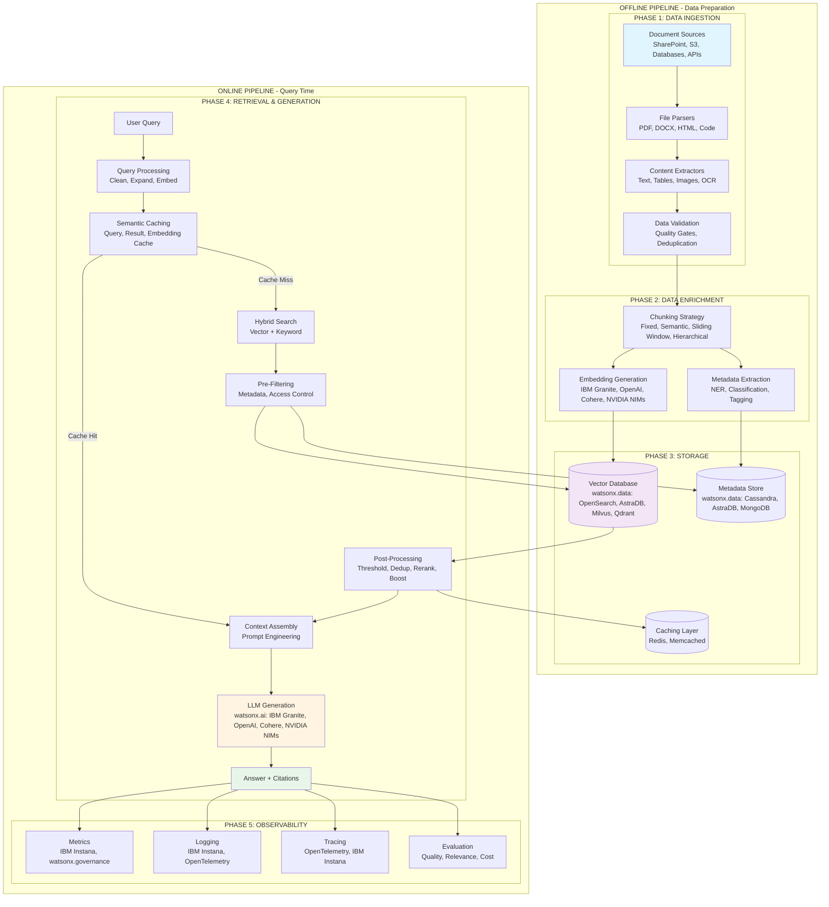
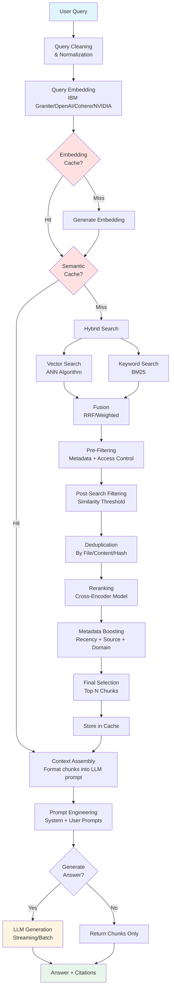
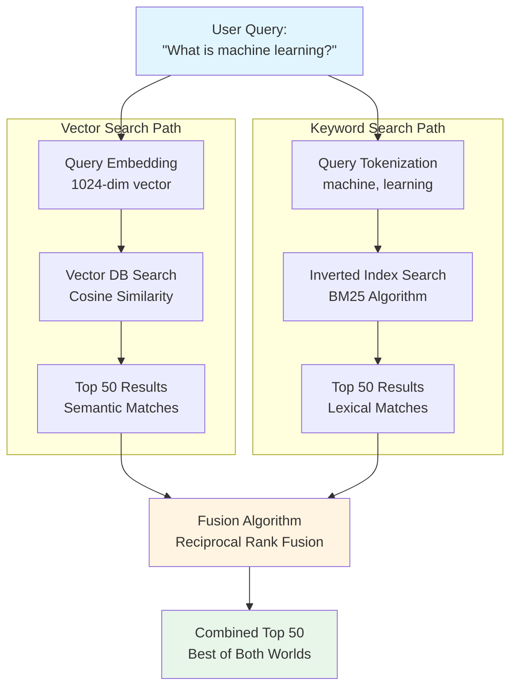
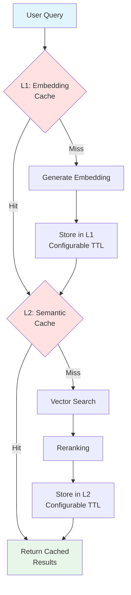
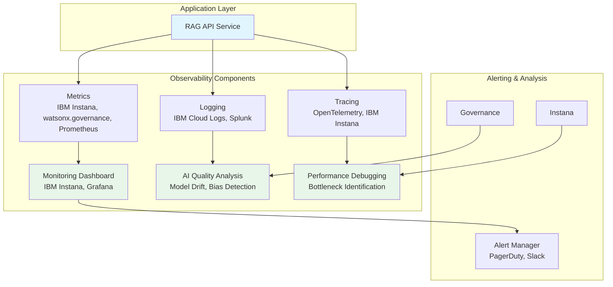

# Enterprise AI Search with RAG: Complete Architecture Guide


## Table of Contents

1. [Introduction](#introduction)
2. [The Challenge: Traditional Search Limitations](#the-challenge-traditional-search-limitations)
3. [What is RAG?](#what-is-rag)
4. [Enterprise RAG Use Cases](#enterprise-rag-use-cases)
5. [RAG Reference Architecture](#rag-reference-architecture)
6. [Data Flow Overview](#data-flow-overview)
7. [Phase 1: Data Ingestion](#phase-1-data-ingestion)
8. [Phase 2: Data Enrichment](#phase-2-data-enrichment)
9. [Phase 3: Storage Architecture](#phase-3-storage-architecture)
10. [Phase 4: Retrieval & Generation Pipeline](#phase-4-retrieval--generation-pipeline)
11. [Phase 5: Observability & Monitoring](#phase-5-observability--monitoring)

---

## Introduction

Retrieval-Augmented Generation (RAG) represents a paradigm shift in how enterprises leverage their knowledge bases with Large Language Models (LLMs). This comprehensive guide provides a detailed technical architecture for implementing enterprise-grade AI search systems using RAG, covering everything from data ingestion to production monitoring.

---

## The Challenge: Traditional Search Limitations

### Traditional Search Problems

Traditional enterprise search systems face fundamental limitations that impact business operations:

- **Keyword matching only** - Misses semantic meaning and context
- **No understanding of context or intent** - Cannot interpret user needs beyond literal terms
- **Poor handling of synonyms and variations** - "automobile" won't find "car"
- **Limited by exact term matches** - Requires users to know exact terminology
- **No ranking by relevance** - Results ranked by keyword frequency, not actual relevance

### Business Impact

These limitations translate directly into business costs:

- Users cannot find relevant information efficiently
- Low productivity and user frustration
- Missed insights and business opportunities
- Poor customer experience and satisfaction

Traditional search engines trap enterprise knowledge in documents that cannot be effectively searched, leading to information silos and lost productivity.

---

## What is RAG?

### Retrieval-Augmented Generation

RAG is a technique that combines information retrieval with generative AI to produce accurate, grounded responses. It addresses the fundamental "hallucination" problem of LLMs by grounding responses in actual enterprise data.

### The 3-Step RAG Process

1. **Retrieve** relevant information from your knowledge base
2. **Augment** the LLM prompt with retrieved context
3. **Generate** accurate, grounded responses with citations

### Key Benefits

RAG offers significant advantages over traditional approaches:

- ✅ **Semantic understanding of queries** - Understands intent, not just keywords
- ✅ **Answers grounded in your data** - Responses based on actual documents, not hallucinated
- ✅ **Always up-to-date** - No model retraining needed when data changes
- ✅ **Transparent with source citations** - Every answer traceable to source documents
- ✅ **Cost-effective vs fine-tuning** - Much cheaper than retraining models
- ✅ **Works with private/proprietary data** - Keeps sensitive data secure

### RAG vs Fine-Tuning

Understanding the difference is crucial for architecture decisions:

- **RAG**: Dynamic knowledge, always current, transparent sources, cost-effective updates
- **Fine-tuning**: Static knowledge baked into weights, expensive, black box, requires retraining for updates

RAG keeps knowledge separate and queryable, while fine-tuning embeds it in model parameters. For enterprise use cases with frequently changing data, RAG is typically the superior choice.

---

## Enterprise RAG Use Cases

RAG is transforming how enterprises access and leverage their knowledge:

**Knowledge Management**: Internal wikis and documentation search, policy and procedure retrieval, employee self-service Q&A systems, and institutional knowledge preservation.

**Customer Support**: Automated support with accurate answers, agent assistance tools, ticket deflection and resolution, and 24/7 customer service availability.

**Compliance & Legal**: Policy search and interpretation, regulatory compliance checks, contract analysis and review, and legal precedent research.

**Research & Development**: Scientific literature search, patent analysis and prior art search, research paper discovery, and technical documentation retrieval.

**Sales & Marketing**: Product information retrieval, competitive intelligence gathering, sales enablement materials, and marketing content discovery.

These use cases demonstrate RAG's versatility across enterprise functions, with typical ROI achieved within 3-6 months of deployment.

---

## RAG Reference Architecture

The RAG architecture can be organized into multiple phases, each with specific responsibilities and technologies. For this guide, we break it down into five key phases that cover the complete lifecycle from data ingestion to production monitoring.

### Complete Pipeline Architecture



### Architecture Overview

The architecture operates through two distinct pipelines: an **offline pipeline** optimized for quality and completeness (runs periodically, batch processing), and an **online pipeline** optimized for speed and user experience (real-time processing with caching). This separation enables independent scaling, different optimization goals, and flexible updates without affecting online performance.

**OFFLINE PIPELINE - Data Preparation:**

**PHASE 1: DATA INGESTION**
- Document Sources (SharePoint, Object Stores, Databases, APIs)
- File Parsers & Content Extractors (PDF, DOCX, HTML, Text, Tables, Images)
- Data Validation & Deduplication

**PHASE 2: DATA ENRICHMENT**
- Chunking Strategy (Fixed, Semantic, Sliding Window, Hierarchical)
- Embedding Generation (watsonx.ai: IBM Granite, OpenAI, Cohere, NVIDIA NIMs)
- Metadata Extraction (NER, Classification, Tagging)

**PHASE 3: STORAGE**
- Vector Database (watsonx.data: OpenSearch, AstraDB, Milvus, Qdrant)
- Metadata Store (watsonx.data: Cassandra, AstraDB, MongoDB)
- Caching Layer (Redis, Memcached)

**ONLINE PIPELINE - Query Time:**

**PHASE 4: RETRIEVAL & GENERATION**
- Query Processing (Clean, Expand, Embed)
- Hybrid Search (Vector + Keyword)
- Pre-Filtering (Metadata, Access Control)
- Post-Retrieval Processing (Threshold, Deduplication, Reranking, Boosting)
- Semantic Caching (Query, Result, Embedding Cache)
- Context Assembly & Prompt Engineering
- LLM Generation (watsonx.ai: IBM Granite, OpenAI, Cohere, NVIDIA NIMs)

**PHASE 5: OBSERVABILITY**
- Metrics (IBM Instana, watsonx.governance)
- Logging (IBM Instana, OpenTelemetry)
- Tracing (OpenTelemetry, IBM Instana)
- Evaluation (Quality, Relevance, Cost)

This cloud-agnostic architecture can be deployed on any platform, with each phase independently scalable based on workload requirements.

---

## Phase 1: Data Ingestion

### Purpose

Acquire and prepare raw documents from various enterprise sources, ensuring data quality and consistency before enrichment.

### 1. Document Sources

Connect to wherever your enterprise data lives:

**Storage Systems:**
- **File systems**: Local, network, distributed file systems
- **Cloud storage**: S3, Azure Blob Storage, Google Cloud Storage
- **Object stores**: MinIO, Ceph, enterprise storage solutions

**Enterprise Systems:**
- **SharePoint, Confluence, Notion, Jira**: Collaborative platforms
- **Databases**: SQL, NoSQL, data warehouses
- **APIs**: REST, GraphQL, custom integrations
- **Email systems**: Exchange, Gmail, custom mail servers

### 2. File Parsers & Content Extractors

Different formats require specialized parsing strategies to extract meaningful content:

**Document Formats:**
- **PDF**: Complex layouts, tables, multi-column, scanned images
- **Office documents**: DOCX, XLSX, PPTX with structured content
- **Web content**: HTML, Markdown with proper structure preservation
- **Code files**: Syntax-aware parsing for programming languages
- **Specialized formats**: CAD, scientific data, proprietary formats

**Content Extraction:**
- **Text extraction**: Primary content with structure preservation
- **Table detection and parsing**: Structured data extraction
- **Image extraction and OCR**: Visual content and scanned documents
- **Metadata extraction**: Document properties and attributes

**Technologies:**
- **docling.ai**: Advanced document understanding and parsing
- **Apache Tika**: Universal document parser supporting 1000+ formats
- **PyPDF2**: Python PDF parsing library
- **Unstructured.io**: Modern document parsing with ML-based extraction

### 3. Data Validation & Deduplication

Prevent bad data from entering the system through comprehensive quality gates:

**Validation & Quality Gates:**
- **File integrity checks**: Detect corrupted or incomplete files
- **Format validation**: Ensure parsers can handle the file type
- **Content quality assessment**: Filter out low-quality or empty content (minimum length, coherence, completeness)
- **Virus/malware scanning**: Security best practice for uploaded content
- **Encoding validation**: Ensure proper UTF-8 encoding to prevent downstream issues
- **Language detection**: Filter or route content based on language requirements
- **PII/sensitive data detection**: Flag or redact personally identifiable information for compliance (GDPR, HIPAA)
- **Content policy checks**: Validate against organizational content policies and regulatory requirements

**Deduplication:**
- **Content-based hashing**: Use MD5/SHA256 for exact duplicate detection
- **Fuzzy matching**: Detect near-duplicates and different versions of same document
- **Version control**: Keep latest version, archive or discard older versions
- **Cross-source deduplication**: Identify same content from multiple sources

**Normalization:**
- **Character encoding (UTF-8)**: Prevent encoding issues across systems
- **Date format standardization**: Enable date-based filtering and sorting
- **Text cleaning**: Remove parsing artifacts and formatting issues
- **Language standardization**: Enable language-specific processing

**Metadata Enrichment:**
- **Extract structured metadata**: Document properties for filtering
- **Classify document types**: Route to appropriate processing pipelines
- **Identify sensitive information**: GDPR, CCPA compliance
- **Apply business rules**: Retention policies, access controls

### Real-Time Data Integration

While the offline pipeline typically processes data in batches, modern RAG systems often require real-time or near-real-time data updates to ensure information freshness. This complements batch ingestion, allowing you to balance thoroughness (batch) with freshness (streaming).

**Streaming Ingestion:**
- **Confluent Kafka (via watsonx.data)**: Stream real-time data updates into your RAG pipeline
- **Change Data Capture (CDC)**: Automatically detect and ingest changes from source systems
- **Event-Driven Architecture**: Trigger processing pipelines based on data events

**Benefits:**
- Keep embeddings synchronized with source systems without full reprocessing
- Reduce latency between data updates and search availability
- Enable incremental updates for cost efficiency
- Support use cases requiring up-to-date information (news, pricing, inventory)

**Implementation Pattern:**
```
Source System → Kafka Topic → Stream Processor → Validation →
Enrichment Pipeline → Vector DB Update
```

**Considerations:**
- Balance between batch reprocessing and incremental streaming updates
- Implement proper ordering and deduplication for streaming data
- Monitor lag and throughput for streaming pipelines
- Handle schema evolution and backward compatibility

### Best Practices

- ✅ Implement quality gates early to prevent wasting resources on bad data
- ✅ Use tiered validation (fast checks first, expensive checks later)
- ✅ Log all processing steps and validation failures for debugging and audit
- ✅ Monitor processing metrics (throughput, error rates, latency, validation pass rates)
- ✅ Handle failures gracefully with retries and dead-letter queues
- ✅ Balance validation strictness with data coverage needs
- ✅ Version control for processing logic and configurations
- ✅ Consider incremental updates vs full reprocessing based on data freshness requirements
- ✅ Implement circuit breakers for external dependencies

---

## Phase 2: Data Enrichment

Data enrichment prepares raw content for semantic search by chunking, embedding, and extracting metadata.

### Chunking Strategies

#### Why Chunking?

- LLMs have context window limits (even GPT-4 with 128K tokens)
- Smaller chunks enable more precise retrieval
- Balance needed: too small (loses context) vs too large (loses precision)

#### Strategy Options

**1. Fixed-Size Chunking**
- Split by character or token count (e.g., 512 tokens)
- ✅ Simple, predictable chunk sizes
- ❌ May break semantic boundaries mid-sentence

**2. Semantic Chunking**
- Split by paragraphs, sections, topics
- ✅ Better retrieval quality, preserves meaning
- ❌ More complex, variable chunk sizes

**3. Sliding Window**
- Overlapping chunks (e.g., 512 tokens, 50 token overlap)
- ✅ Captures cross-boundary information
- ❌ Increases storage and processing costs

**4. Hierarchical Chunking**
- Multiple levels (document → section → paragraph)
- ✅ Best for complex documents like technical manuals
- ❌ Most complex to implement

#### Recommended Approach

- Start with semantic chunking (paragraphs)
- Add 10-20% overlap for context preservation
- Typical chunk size: 300-800 tokens
- Test different strategies with your actual data
- Monitor chunk size distribution for outliers

### Embedding Generation

#### What are Embeddings?

Dense vector representations of text that capture semantic meaning in high-dimensional space. Similar meanings produce similar vectors, enabling semantic search.

#### Key Considerations

**Dimension Size**: Higher dimensions = more accurate, but slower and more storage
- 384-768 dimensions: Fast, good for most use cases
- 1024-1536 dimensions: Better accuracy, standard choice
- 3072-4096 dimensions: Highest accuracy, slower and more expensive

**Domain Specificity**: General-purpose vs domain-specific models
- General: Good for diverse content
- Domain-specific: Better for specialized content (legal, medical, code)

**Language Support**: Multilingual vs single-language models
- Multilingual: Support multiple languages in one model
- Single-language: Better performance for specific language

**Cost**: API-based vs self-hosted
- API-based: Easy to start, pay per use
- Self-hosted: Higher upfront cost, lower long-term cost at scale

#### Model Options

- **IBM Granite (via watsonx.ai)**: Enterprise-grade embeddings optimized for business use cases, available through watsonx.ai platform with governance and compliance features
- **OpenAI**: High quality, popular, but expensive at scale
- **Cohere**: Good performance, excellent multilingual support
- **NVIDIA NIMs**: GPU-optimized, great for self-hosted deployments
- **Sentence Transformers**: Open source, free but requires infrastructure

#### Best Practices

- ✅ Use same model for documents and queries (critical!)
- ✅ Batch embed documents for efficiency
- ✅ Cache embeddings aggressively (they don't change)
- ✅ Version control your embedding model
- ✅ Monitor embedding costs at scale

### Metadata Extraction

#### Why Metadata Matters

Metadata is the secret weapon for RAG accuracy:

- Enables filtering and faceted search
- Powers metadata-aware boosting
- Supports access control and security
- Improves retrieval accuracy significantly

#### Metadata Types

**1. Structural Metadata**
- Document ID, filename, file type, page count
- Creation/modification dates, author, owner
- Document size, word count, language

**2. Content Metadata**
- Language, document type, topics, categories
- Named entities (people, places, organizations)
- Keywords, tags, classifications

**3. Business Metadata**
- Source system, business unit, department
- Confidentiality level, retention policy
- Approval status, version information

**4. Quality Metadata**
- Confidence scores, processing status
- Validation flags, error indicators
- Extraction timestamps, processing duration

#### Extraction Techniques

- **Rule-based**: Regex, pattern matching (fast, deterministic)
- **NLP-based**: NER, classification models (more sophisticated)
- **LLM-based**: GPT-4 for complex extraction (most powerful but expensive)
- **Hybrid**: Combine multiple approaches for best results

#### Best Practices

- Design metadata schema carefully (hard to change later)
- Balance extraction cost vs value (not all metadata is useful)
- Consider metadata versioning for schema evolution
- Index metadata fields for fast filtering
- Monitor metadata quality and completeness

---

## Phase 3: Storage Architecture

### Storage Components

#### 1. Vector Database

Stores embeddings optimized for similarity search:

**Options:**
- **OpenSearch (via watsonx.data)**: Native OpenSearch integration for vector search with enterprise data governance
- **AstraDB (via watsonx.data)**: Managed Cassandra with vector capabilities, now integrated with watsonx.data for unified data access
- **Milvus (via watsonx.data)**: Integrated vector search within watsonx.data lakehouse architecture, unified governance
- **Qdrant**: High performance, Rust-based, excellent for self-hosting
- **pgvector**: PostgreSQL extension, great if you already use PostgreSQL

**Key Features:**
- HNSW/IVF indexes for fast approximate nearest neighbor search
- Metadata filtering during search (not just after)
- Horizontal scaling for large datasets
- High availability and disaster recovery

#### 2. Metadata Store

Structured data about documents:

**Options:**
- **Cassandra (via watsonx.data)**: Distributed metadata storage with watsonx.data's unified query engine
- **Astra DB (via watsonx.data)**: Unified with vector storage, integrated governance
- **PostgreSQL**: Mature, reliable, excellent query capabilities
- **MongoDB**: Flexible schema, good for evolving metadata

#### 3. Caching Layer

Hot data for fast access:

**Options:**
- **Redis**: Most popular, feature-rich
- **Memcached**: Simple, fast, lightweight

### Architecture Patterns

**Unified**: Single database for vectors + metadata
- ✅ Simpler architecture, easier to manage
- ❌ Less flexibility, potential performance tradeoffs

**Separated**: Vector DB + separate metadata store
- ✅ Optimized for each workload
- ❌ More complex, requires synchronization

**Hybrid**: Vector DB with metadata, separate object store
- ✅ Balance of simplicity and optimization
- ✅ Most common in production deployments

### Best Practices

- Consider data residency requirements (GDPR, data sovereignty)
- Plan for backup and disaster recovery
- Monitor storage costs (vectors take significant space)
- Index metadata fields for fast filtering
- Implement proper access controls and encryption

---

## Phase 4: Retrieval & Generation Pipeline

This is where RAG intelligence happens. The retrieval pipeline consists of seven distinct steps, each improving accuracy or performance.

### Retrieval Pipeline



### 1. Query Processing & Understanding

#### Query Processing Steps

**Query Cleaning:**
- Remove special characters that might confuse search
- Normalize whitespace and formatting
- Handle typos with spell check
- Expand abbreviations (e.g., "ML" → "machine learning")

**Query Understanding:**
- Intent classification (search, question, command)
- Entity extraction (dates, names, places)
- Sentiment analysis (if relevant for use case)

**Query Expansion:**
- Add synonyms ("car" → "automobile", "vehicle")
- Add related terms from domain knowledge
- Handle acronyms and abbreviations
- Example: User searches "ML" but docs say "machine learning"

**Query Embedding:**
- Convert to vector using SAME model as document embedding
- Cache query embeddings (many users ask similar questions)
- Fast embedding generation

#### Advanced Techniques

- **Query Rewriting**: LLM-based query reformulation for clarity
- **HyDE (Hypothetical Document Embeddings)**: Generate hypothetical answer document, embed it for better retrieval
- **Query Routing**: Route to specialized retrievers based on intent classification

### 2. Hybrid Search - Vector + Keyword

Hybrid search is the gold standard for production RAG systems, combining the strengths of both semantic and lexical search.



#### Why Hybrid Search?

Best of both worlds: semantic understanding + keyword matching

**Vector Search (Semantic):**
- Uses embeddings and cosine similarity
- ✅ Handles synonyms, paraphrasing, understands context
- ❌ May miss exact term matches, struggles with rare terms

**Keyword Search (Lexical):**
- Uses BM25, TF-IDF algorithms
- ✅ Great for specific terms, IDs, codes, fast
- ❌ No semantic understanding, misses synonyms

**Hybrid Search:**
- Combines both methods with fusion algorithms
- ✅ Best accuracy for diverse query types
- ❌ More complex, slightly slower

#### Fusion Strategies

- **Reciprocal Rank Fusion (RRF)**: Combine rankings (most popular)
- **Weighted Sum**: α × vector_score + (1-α) × keyword_score
- **Cascade**: Vector search first, keyword as fallback
- **Parallel**: Run both, merge top results

### 3. Pre-Filtering - Metadata & Access Control

Pre-filtering is a huge performance optimization that reduces search space before expensive vector operations.

#### Why Pre-Filter?

- Reduce search space before expensive vector search
- Enforce access control and business rules
- Improve relevance by scoping results
- Reduce costs (fewer vectors to compare)

#### Performance Impact Example

- **Without Pre-Filtering**: Search 1M vectors → retrieve 100 → filter to 10 (100% search space)
- **With Pre-Filtering**: Filter to 100K vectors → search → retrieve 100 (90% reduction in search space)
- **Result**: 10x faster search, lower latency, reduced costs

Dramatic performance improvement with effective pre-filtering

#### Filter Types

**Metadata Filters:**
- date_created >= "2024-01-01"
- document_type in ["pdf", "docx"]
- department = "engineering"
- status != "archived"

**Access Control Filters:**
- User permissions (RBAC - Role-Based Access Control)
- ABAC (Attribute-Based Access Control) for fine-grained control
- Data classification levels (public, confidential, secret)
- Geographic restrictions (data residency requirements)

**Business Rule Filters:**
- Active/inactive status
- Version control (latest only)
- Quality thresholds (minimum quality score)
- Compliance requirements (retention policies)

### 4. Post-Retrieval Processing

#### Similarity Thresholding

Quality gate to ensure relevance:

- Most vector DBs return a similarity score (distance score)
- Vector response can include low scoring results
- Low-similarity results can confuse the LLM

**Threshold Guidelines:**
- 0.9-1.0: Very high confidence (may be too restrictive)
- 0.8-0.9: High confidence (recommended for critical applications)
- 0.7-0.8: Medium confidence (good balance for most use cases)
- 0.6-0.7: Lower confidence (more recall but less precision)
- Below 0.6: Usually not useful (too many irrelevant results)

**Example Impact:**
```
Before Threshold: 50 chunks (similarity 0.3-0.95)
After Threshold (0.7): 12 chunks (similarity 0.7-0.95)
Result: More focused, relevant context for LLM
```

**Dynamic Threshold:**
- Adjust based on query type
- Lower threshold for exploratory queries
- Higher threshold for factual questions

#### Deduplication

Crucial for efficient LLM context usage:

**Why Deduplication?**
- Vector search often returns multiple chunks from same source
- Wastes LLM context window with redundant information
- Reduces diversity of information sources
- Increases token costs

**Deduplication Strategies:**

1. **By Document/File**
   - Keep top-n chunks per document
   - Choose highest-scoring chunks

2. **By Content Hash**
   - Remove duplicate content
   - Handles copy-paste scenarios

**Benefits:**
- ✅ Reduces redundancy
- ✅ Increases context diversity
- ✅ Optimizes token usage

#### Reranking

Second-stage ranking after initial retrieval using more sophisticated models.

**Why Rerank?**
- Vector search optimized for speed, not accuracy
- Reranking models can consider query-document interactions
- Improves relevance of top results
- Industry standard for production RAG systems

**How It Works:**
1. Initial retrieval (fast, broad): Retrieve 50-100 candidates
2. Reranking (slower, accurate): Rerank to top 10-20

**Model Options:**
- Cohere Rerank: Very popular, high accuracy, multilingual
- NVIDIA NV-RerankQA: Fast, good accuracy
- Cross-Encoder (Sentence Transformers): Open source, customizable
- BGE Reranker (BAAI): Open source, good performance

**Best Practices:**
- ✅ Retrieve more candidates than needed (over-fetch)
- ✅ Typical ratio: retrieve 50-100, rerank to 10-20
- ✅ Cache reranking results
- ✅ Monitor reranking latency and accuracy

#### Boosting

Adjust relevance scores based on business metadata and feedback after semantic reranking.

**Boost Factors:**

1. **Recency Boost**: Newer documents ranked higher for time-sensitive queries
2. **Source Authority Boost**: Trusted sources ranked higher (e.g., official documentation over user-generated content)
3. **Profile/Result Alignment**: Align user's profile with results (e.g., engineering user sees engineering docs first)
4. **Quality Indicators**: View count, ratings, feedback

**Benefits:**
Balances semantic relevance with business priorities

### 5. Semantic Caching

Cache retrieval results for repeated/similar queries using semantic similarity.



#### Caching Layers

**1. Query Embedding Cache**
- Cache expensive embedding computations
- Configurable time-to-live (TTL)
- High hit rate for repeated queries

**2. Vector Search Results Cache**
- Cache raw search results
- Configurable TTL based on data freshness requirements
- Saves expensive vector search

**3. Final Results Cache**
- Cache processed, reranked results
- Configurable TTL balancing freshness and performance
- Saves entire pipeline

#### Benefits

- ✅ **Performance**: 10-100x faster for cache hits
- ✅ **Consistency**: Similar queries = same results
- ✅ **Cost Reduction**: Fewer API calls
- ✅ **Reliability**: Reduces dependency on external services

#### Cache Invalidation

- Time-based (TTL)
- Content-based (when documents updated)
- Manual (for urgent updates)
- Version-based (when models change)

### 6. Context Assembly & Prompt Engineering

#### Context Assembly Process

1. **Chunk Selection & Ordering**: Select top N chunks and order by relevance (highest first)
2. **Context Formatting**: Add source references, dates, metadata and structure for easy LLM parsing
3. **Citation Generation**: Enable traceability and verification
4. **Context Window Management**: Monitor token count vs LLM limits

#### Prompt Engineering Best Practices

**System Prompt:**
- Define role and behavior
- Set constraints (answer only from context)
- Specify output format

**Example**: _"You are a concise legal assistant. Always cite sources. Never use emojis. If you don't know the answer, say 'I am not sure'."_

**User Prompt:**
- Include formatted context
- Present the question
- Request citations

**Example**: _"What is the statute of limitations for a contract dispute in New York?"_

#### Advanced Techniques

- **Chain of Thought**: Ask LLM to reason step by step
- **Few-Shot Examples**: Include example Q&A pairs
- **Role-Based Prompts**: Adapt tone/style to user role

### 7. LLM Generation

The final step generates the answer using the assembled context.

**LLM Options (via watsonx.ai):**
- **IBM Granite**: Enterprise-optimized models with governance
- **OpenAI**: GPT-4, GPT-3.5 for high-quality responses
- **Cohere**: Command models for generation tasks
- **NVIDIA NIMs**: GPU-optimized inference
- **Other models**: Llama, Mistral, Claude, and custom fine-tuned models

**Generation Options:**
- **Streaming**: Tokens appear immediately (better UX)
- **Batch**: Complete response at once (easier error handling)

**Quality Controls:**
- Hallucination detection
- Relevance scoring
- Safety filters
- Fact checking

**Performance Optimization:**
- Parallel processing where possible
- Connection pooling for API calls
- Response caching for identical contexts
- Async processing for non-critical features

---

## Phase 5: Observability & Monitoring

Observability is crucial for production RAG systems. Many things can go wrong, and performance can degrade silently without proper monitoring.



### Why Observability Matters

- RAG systems are complex with many failure modes
- Performance can degrade silently
- User satisfaction depends on quality and speed
- Cost optimization requires detailed metrics

### Key Metrics to Track

#### Performance Metrics

- **End-to-end latency**: Total response time from query to answer
- **Component latency**: Embedding, search, reranking, LLM generation
- **Throughput**: Queries per second the system can handle
- **Cache hit rates**: Embedding cache, search cache, result caches
- **Error rates**: By component and error type for debugging

#### Quality Metrics

- **Retrieval accuracy**: Are relevant chunks in top-k results?
- **Answer quality**: Human ratings, automated scoring (LLM-as-judge)
- **Citation accuracy**: Correct source attribution
- **Hallucination rate**: Answers not grounded in provided context
- **User satisfaction**: Thumbs up/down, detailed feedback, ratings

#### Cost Metrics

- **Token usage**: Embedding API calls, LLM generation tokens
- **API costs**: By provider (OpenAI, Cohere, etc.) and model
- **Infrastructure costs**: Compute, storage, bandwidth
- **Cost per query**: Total cost divided by query volume

#### Business Metrics

- **User engagement**: Session length, return rate, active users
- **Query success rate**: Percentage of queries that get useful answers
- **Time to answer**: How quickly users find the information they need
- **Knowledge coverage**: What topics are well/poorly covered

### Monitoring Tools and Platforms

**Recommended IBM Stack:**
- **IBM watsonx.governance**: AI lifecycle management, model monitoring, compliance tracking, bias detection
- **IBM Instana**: Application performance monitoring, distributed tracing, real-time observability
- **IBM Cloud Logs**: Centralized logging and analysis
- **OpenTelemetry**: Industry-standard distributed tracing and metrics collection

**Alternative Options:**
- **APM**: New Relic, Dynatrace, AppDynamics
- **Metrics**: Prometheus, DataDog, CloudWatch
- **Logging**: Splunk, CloudWatch Logs

### Best Practices

- Set up comprehensive monitoring from day one
- Don't wait until you have problems to implement monitoring
- Implement user feedback collection early (thumbs up/down is simple but effective)
- Monitor cache hit rates - low rates indicate problems
- Set up alerts for critical issues:
  - **Critical**: System down, high error rates (>5%) - page on-call team
  - **Warning**: Degraded performance, low cache hit rates - email team
  - **Info**: Usage patterns, cost thresholds - dashboard only

### Evaluation Frameworks

- **RAGAS**: RAG Assessment framework with comprehensive metrics
- **TruLens**: Real-time monitoring and evaluation
- **LangSmith**: LangChain's evaluation platform
- **Custom**: Build your own evaluation pipeline

### Continuous Improvement

- Implement A/B testing for improvements
- Test changes with subset of traffic
- Measure impact on quality and performance
- Roll out successful changes gradually
- Regular evaluation cycles (weekly, monthly) to track trends

---

## Technology Stack Recommendation

### IBM watsonx.data Reference Architecture

For organizations seeking an integrated, enterprise-grade RAG solution, IBM watsonx.data provides a comprehensive platform that simplifies architecture while maintaining flexibility and performance. **watsonx.data makes ALL your enterprise data accessible and understandable for AI to help you maximize business value.** The unified lakehouse approach consolidates all data storage and access needs into a single, governed platform.

#### Architecture Overview

```
┌────────────────────────────────────────────────────────────┐
│                    IBM watsonx Platform                    │
├────────────────────────────────────────────────────────────┤
│                                                            │
│  ┌──────────────────┐  ┌──────────────────────────────┐    │
│  │  watsonx.data    │  │       watsonx.ai             │    │
│  │  ─────────────   │  │  ──────────────────────────  │    │
│  │  • OpenSearch    │  │  • IBM Granite LLMs          │    │
│  │  • AstraDB       │  │  • OpenAI (GPT-4, etc.)      │    │
│  │  • Milvus        │  │  • Cohere (Command, etc.)    │    │
│  │  • Cassandra     │  │  • NVIDIA NIMs               │    │
│  │  • Kafka         │  │  • Other Models              │    │
│  │  • Object Store  │  │  • Embeddings & Inference    │    │
│  └──────────────────┘  └──────────────────────────────┘    │
│                                                            │
│  ┌──────────────────────────────────────────────────────┐  │
│  │           watsonx.governance                         │  │
│  │  • Model Monitoring  • Compliance  • Risk Management │  │
│  └──────────────────────────────────────────────────────┘  │
│                                                            │
└────────────────────────────────────────────────────────────┘
```

#### Technology Stack

**Data Layer - IBM watsonx.data (Unified Lakehouse):**
- **Vector Search**: OpenSearch, AstraDB, or Milvus integration for semantic search
- **Metadata Management**: Cassandra/AstraDB for document and chunk metadata
- **Object Storage**: S3-compatible interfaces (IBM Cloud Object Storage)
- **Streaming Data**: Confluent Kafka integration for real-time data ingestion
- **Open Table Formats**: Iceberg, Hudi, Delta Lake for cost-optimized storage
- **Query Federation**: Single interface to query across all data sources
- **Multi-Engine Support**: Presto, Spark, and other engines for diverse workloads

**AI Layer - IBM watsonx.ai:**
- **LLM Hosting & Inference**: Flexible model deployment options
  - IBM Granite models (optimized for enterprise use cases)
  - OpenAI models (GPT-4, GPT-3.5)
  - Cohere models (Command, Generate)
  - NVIDIA NIMs (optimized inference)
  - Other models (Llama, Mistral, Claude, etc.)
  - Custom fine-tuned models
- **Enterprise Features**: Built-in governance, compliance, and performance optimization

**Governance & Monitoring:**
- **IBM watsonx.governance**: AI lifecycle management
  - Model monitoring and drift detection
  - Compliance tracking and audit trails
  - Risk management and bias detection
  - Unified governance across all data sources and AI models
- **IBM Instana**: Application performance monitoring
- **OpenTelemetry**: Distributed tracing across the RAG pipeline

#### Key Benefits

1. **Unified Platform**: Single lakehouse consolidates vector databases, metadata stores, object storage, and streaming data
2. **Simplified Integration**: Native connectors for Cassandra, OpenSearch, Kafka, and traditional databases reduce complexity
3. **Cost Optimization**: Open table formats (Iceberg, Hudi, Delta Lake) and efficient storage reduce infrastructure costs by 40-60%
4. **Enterprise Governance**: Single governance layer across all data sources and AI models with comprehensive audit trails
5. **Query Federation**: Query across heterogeneous data sources with a single interface, eliminating data silos
6. **Flexibility & Choice**: Works with existing tools while providing integrated alternatives; supports multiple LLM providers
7. **Enterprise Support**: Comprehensive support and SLAs for production deployments with proven scalability
8. **Performance at Scale**: Multi-engine support (Presto, Spark) optimized for diverse RAG workloads

#### Implementation Considerations

**When to Choose watsonx.data:**
- **When you need to maximize business value from ALL your enterprise data** - watsonx.data unifies access to structured, unstructured, and streaming data
- Enterprise organizations requiring unified governance and compliance
- Multi-cloud or hybrid cloud deployments needing consistent data access
- Teams seeking to reduce integration complexity and operational overhead
- Organizations with diverse data sources requiring query federation
- Projects requiring enterprise-grade support and SLAs

---

_**Author**: Pravin Bhat, Enterprise Solution Architect, IBM (Watsonx Data Labs)_

_**Last Updated**: April 17th, 2026_

_**Target Audience**: Technical Architects, Solution Architects, Engineering leaders, AI Developers_

---

_✨ Special thanks to [IBM BOB](https://bob.ibm.com/) for being my AI blog partner in crafting this guide! 🤖_
