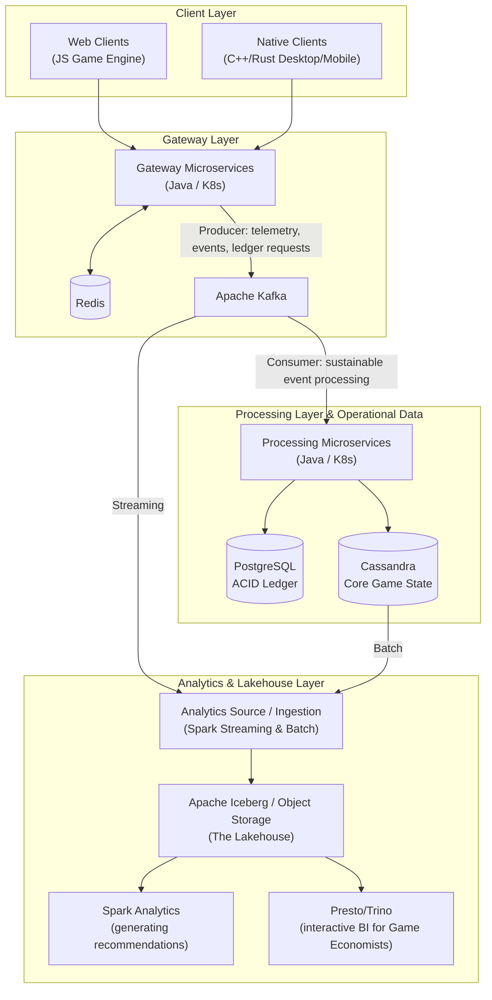
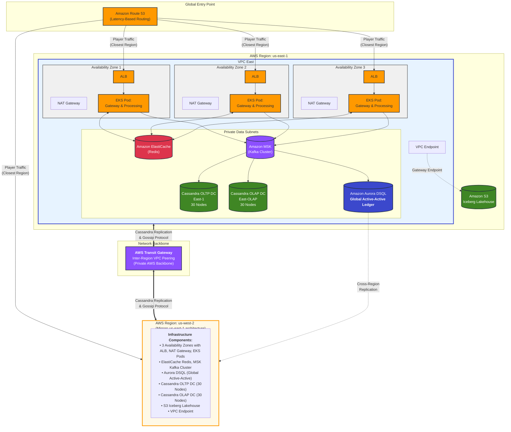

# Globally Distributed Multiplayer Gaming & Analytics Platform

This platform supports millions of concurrent players across the globe, handling massive traffic spikes during game launches.

The system manages two critical workloads: real-time game state with ultra-low latency, and secure financial transactions for in-game purchases.

The architecture separates operational data from analytics data to maintain performance. Real-time game operations use fast NoSQL databases and event streaming, while analytics run on a separate data lakehouse. This separation ensures the live gaming experience remains smooth even when running large-scale data analysis.

---

## System Diagram

### 1. The Client Layer

The platform supports multiple client types, each optimized for its platform while connecting through a unified API boundary:
- **Web Clients**: JavaScript game engines for browser-based gameplay
- **Native Clients**: C++ and Rust for high-performance desktop and mobile applications

### 2. The Gateway Layer

**Gateway Microservices** (Java / K8s) serve as the entry point for all client requests:
- Maintains bi-directional communication with **Redis** for ultra-fast session and state management
- Acts as a producer to **Apache Kafka**, sending fire-and-forget telemetry, events, and ledger requests for asynchronous processing

### 3. The Processing Layer & Operational Data

**Processing Microservices** (Java / K8s) consume events from Kafka at a sustainable rate to prevent system overload:
- Writes to **PostgreSQL**: ACID-compliant ledger for financial transactions
- Writes to **Cassandra**: Core game state data for high-throughput operations

### 4. The Analytics & Lakehouse Layer

**Analytics Source / Ingestion** (Spark Streaming & Batch) receives data from two sources:
- Real-time streaming data from **Kafka**
- Batch data extracted from **Cassandra**

The ingested data flows into **Apache Iceberg / Object Storage** (The Lakehouse), which serves as the central analytics repository. Two systems consume data from the lakehouse:
- **Spark Analytics**: Generates player recommendations and insights
- **Presto/Trino**: Provides interactive BI capabilities for game economists to analyze the game economy

---

## AWS Cloud Deployment Diagram

The platform implements an Active-Active multi-region deployment strategy across two AWS regions for global availability and low latency.

### 1. Global Entry Point

**Amazon Route 53** serves as the global DNS service, using Latency-Based Routing to intelligently direct player traffic to the geographically closest region, minimizing network latency for players worldwide.

### 2. AWS Region 1: us-east-1

**VPC East** is architected with high availability across 3 Availability Zones (AZs):
- **Public Subnets**: Application Load Balancers (ALB) distribute incoming traffic, while NAT Gateways enable outbound internet connectivity for private resources
- **Private App Subnets (Compute)**: Amazon EKS Cluster hosts Java Gateway and Processing microservices as Kubernetes pods, distributed across all 3 AZs for fault tolerance
- **Private Data Subnets (Persistence)**:
  - **Amazon ElastiCache** (Redis) provides ultra-low latency caching and session management
  - **Amazon MSK** (Managed Kafka Cluster) serves as the event streaming backbone
  - **Amazon Aurora DSQL** operates as the globally distributed active-active ledger for financial transactions
  - Two distinct Cassandra clusters run on EC2: **Cassandra OLTP DC** (East-1, 30 Nodes) for real-time operations and **Cassandra OLAP DC** (East-OLAP, 30 Nodes) for analytics workloads
- **VPC Endpoints**: Gateway endpoints provide private connectivity to Amazon S3, where the Iceberg Lakehouse resides

### 3. AWS Region 2: us-west-2

**VPC West** mirrors the us-east-1 architecture with identical infrastructure components:
- 3 Availability Zones with ALB, NAT Gateways, and EKS pods (Gateway & Processing services)
- ElastiCache (Redis), MSK (Kafka), and S3 Iceberg Lakehouse
- Aurora DSQL operates as a global active-active database with multi-region write capability
- Cassandra OLTP DC (West-1, 30 Nodes) and OLAP DC (West-OLAP, 30 Nodes)

### 4. Network Backbone

**AWS Transit Gateway** (or Inter-Region VPC Peering) establishes bi-directional private connectivity between the two VPCs. This critical infrastructure enables Cassandra nodes to replicate data and execute gossip protocol communications over the private AWS backbone, avoiding the public internet for enhanced security and performance.

---

## System Design Document: Multiplayer Gaming Platform

### 1. Tech Stack Overview

We chose technologies optimized for each layer of the system:

| Layer               | Technology Stack                            | Primary Function                                                                    |
| ---------------------| ---------------------------------------------| -------------------------------------------------------------------------------------|
| Frontend/Edge       | JavaScript (Web), C++/Rust (Desktop/Mobile) | Platform-optimized client engines communicating with the backend                    |
| Backend Gateway     | Java (Microservices)                        | Handles incoming player requests and sends events to Kafka                          |
| Backend Processing  | Java (Microservices)                        | Processes events from Kafka and writes to databases                                 |
| Operational DBs     | PostgreSQL, Cassandra, Redis                | Financial transactions (Postgres), game state (Cassandra), and session data (Redis) |
| Event Backbone      | Apache Kafka                                | Message queue for asynchronous event processing                                     |
| Analytics Lakehouse | Apache Spark, Apache Iceberg, Presto        | ETL/ELT ingestion, open-table format storage, and federated BI querying             |

### 2. Application Layering & Compute Orchestration (The Core Loop)

To handle massive player surges without overwhelming the databases, we separated the application into two layers: Gateway and Processing.

- **Gateway Layer**: Lightweight Java services handle initial player connections. They use Redis for fast operations like matchmaking (sub-millisecond response times). For other events, they send messages to Kafka and immediately respond to the player.

- **Backend Processing**: Separate Java services consume events from Kafka at a manageable rate. These services run in Kubernetes and automatically scale up or down based on the message queue size. They handle the heavy processing and write data to databases.

### 3. The Decoupled Data Tier (Ledger vs. State)

We separated financial data from game state data to ensure transaction accuracy while maintaining performance.

- **Financial Ledger**: All in-game purchases go directly to PostgreSQL, which prevents duplicate charges and ensures transaction accuracy.

- **Session State**: Redis handles temporary, high-frequency data like active sessions.

- **Game State**: Cassandra stores core game data. We use `(user-id, game-id)` as the partition key to distribute load evenly across servers, and `(time-stamp)` to sort events chronologically.

### 4. High-Availability 4-DC Cassandra Topology

To separate live game operations from analytics, we deployed a 120-node Cassandra cluster across 4 data centers.

- **Live Game Data Centers**: Two data centers (East-1 and West-1, 30 nodes each) handle real-time game operations.

- **Analytics Data Centers**: Two additional data centers (30 nodes each) run analytics workloads using Spark, keeping them separate from live game traffic.

- **Data Replication**: Each piece of data is stored on 3 nodes (Replication Factor of 3). We use `LOCAL_QUORUM` for reads and writes, which ensures data consistency within a region while accepting eventual consistency across regions. This keeps game response times under a millisecond.

### 5. The Event-Driven Backbone & Analytics Lakehouse

We built two separate data pipelines to keep analytics workloads from impacting live game performance.

- **Data Ingestion**: Spark jobs handle data ingestion in two ways. High-volume player events flow directly from Kafka to the lakehouse in real-time. Aggregated data is extracted from Cassandra analytics nodes in batches.

- **Storage**: Data is organized into fact and dimension tables and stored in cloud object storage using Apache Iceberg as an open table format.

- **Data Usage**: Data scientists use Spark for machine learning and recommendations. Game economists use Presto for fast, interactive queries to monitor the game economy.

### 6. AWS Cloud Deployment & Network Architecture

The platform runs in two AWS regions (Active-Active) to ensure low latency and high availability, using a mix of managed services and custom infrastructure.

- **Global Traffic Routing**: Amazon Route 53 routes players to the closest region (us-east-1 or us-west-2) for the lowest latency.

- **Network Isolation (VPC Design)**: Each region operates within its own Virtual Private Cloud (VPC) distributed across 3 Availability Zones (AZs).
  - All compute and data tiers are isolated in Private Subnets, accessible only via internal VPC routing
  - Ingress traffic is strictly controlled via internet-facing Application Load Balancers (ALBs) in the public subnets
  - AWS Transit Gateway is utilized to bridge the East and West VPCs, enabling secure, low-latency, private backbone communication for Cassandra cross-region replication and Kafka cluster mirroring

- **Managed Services**:
  - **Amazon EKS**: Manages our Kubernetes clusters for Java microservices. Services automatically scale based on Kafka queue size
  - **Amazon MSK**: Fully managed Kafka service that handles the event streaming infrastructure
  - **Amazon Aurora DSQL**: Globally distributed active-active database that manages financial transactions with multi-region write capability and automatic conflict resolution

- **Cassandra on EC2**:
  - The 120-node Cassandra cluster runs on EC2 instances (i3en or i4i storage-optimized) rather than managed services
  - These instances provide the high-speed local disk I/O needed for Cassandra's write operations
  - Instances are distributed across 3 availability zones in each region for redundancy

---

_✨ Markdown formatting and diagram syntax assisted by AI. Architecture and design are my own._
