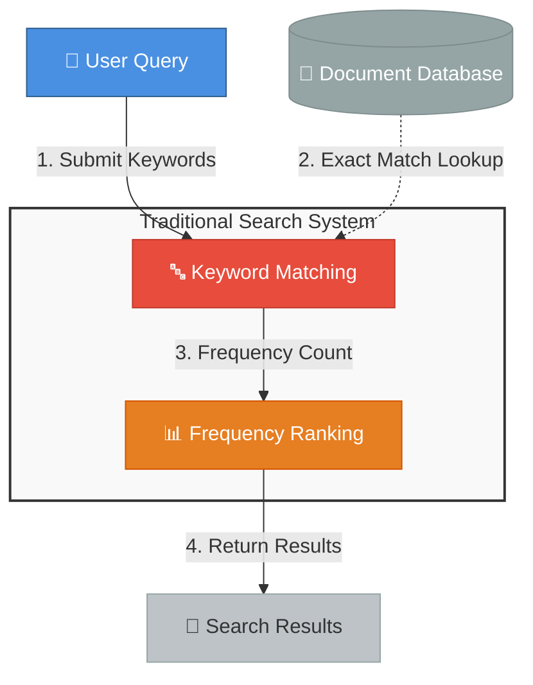
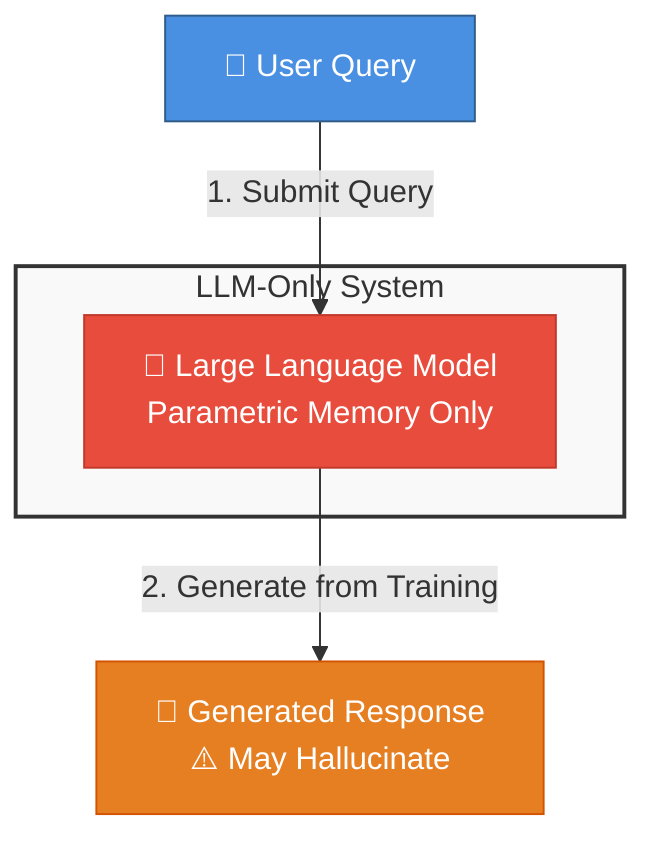
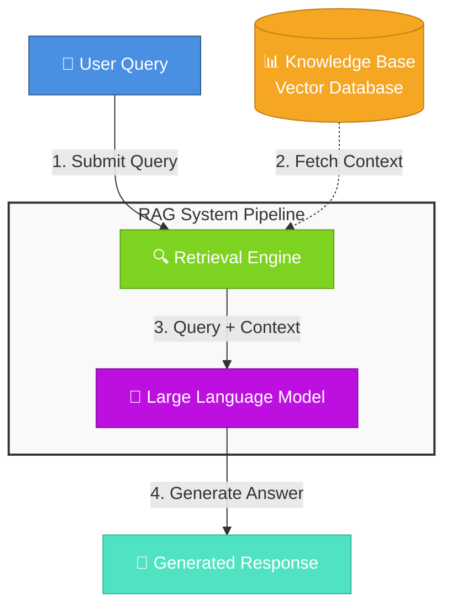

# Why RAG (Retrieval-Augmented Generation)?

## Table of Contents

1. [Introduction](#introduction)
2. [The Challenge: Traditional Search Limitations](#the-challenge-traditional-search-limitations)
3. [The Challenge: AI/LLM-Only Search Limitations](#the-challenge-aillm-only-search-limitations)
4. [The Solution: RAG (Retrieval-Augmented Generation)](#the-solution-rag-retrieval-augmented-generation)
5. [High-Level RAG System Architecture](#high-level-rag-system-architecture)
6. [RAG System Flow](#rag-system-flow)
7. [Key Benefits of RAG](#key-benefits-of-rag)
8. [Next Steps](#next-steps)

---

## Introduction

Enterprise search and information retrieval have evolved significantly, yet organizations still struggle to provide accurate, contextual answers to user queries. Traditional keyword-based search systems miss semantic meaning, while standalone AI models can hallucinate or provide outdated information.

**Retrieval-Augmented Generation (RAG)** represents a breakthrough approach that combines the best of both worlds: the semantic understanding of Large Language Models with the factual grounding of enterprise knowledge bases. This document explores why RAG has become the preferred architecture for enterprise AI search systems.

---

## The Challenge: Traditional Search Limitations

Traditional enterprise search has fundamental limitations:

- **Keyword matching only**
  - Misses semantic meaning and context

- **No understanding of context or intent**
  - Cannot interpret beyond literal terms

- **Poor handling of synonyms and variations**
  - "automobile" won't find "car"

- **No ranking by relevance**
  - Results ranked by keyword frequency, not actual relevance

### Traditional Search Architecture

### Business Impact

These limitations translate directly into business costs:

- Users cannot find relevant information efficiently
- Low productivity and user frustration
- Missed insights and business opportunities
- Poor customer experience and satisfaction

Traditional search engines trap enterprise knowledge in documents that cannot be effectively searched or understood, leading to information silos and lost productivity.

---

## The Challenge: LLM-Only Search Limitations

Using LLMs alone without retrieval also has significant drawbacks:

- **Hallucinations and fabricated information**
  - Models may generate plausible-sounding but incorrect answers
  - No way to verify accuracy of responses

- **Outdated knowledge**
  - Training data has a cutoff date
  - Cannot access recent information or updates

- **No source attribution**
  - Cannot cite or reference specific documents
  - Difficult to verify or audit responses

- **Limited domain-specific knowledge**
  - General training may lack specialized enterprise data
  - Cannot access proprietary or confidential information

- **Inconsistent responses**
  - Same question may yield different answers
  - No grounding in factual data sources

### LLM-Only Search Architecture

### Business Impact

These limitations translate directly into business risks:

- Unreliable information leading to poor decision-making
- Legal and compliance risks from inaccurate or fabricated responses
- Inability to leverage current enterprise knowledge and data
- Lack of accountability and auditability in AI-generated content
- High costs of model retraining to keep information current

LLM-only systems, while powerful, cannot access enterprise-specific knowledge or provide verifiable, up-to-date information, limiting their effectiveness for mission-critical business applications.

---

## The Solution: RAG (Retrieval-Augmented Generation)

RAG solves both traditional search and LLM-only limitations by combining retrieval and generation in a unified pipeline to produce accurate, grounded responses:

### How RAG Addresses the Challenges

**Solving Traditional Search Problems:**
- ✅ **Semantic Understanding**: Uses vector embeddings to understand meaning, not just keywords
- ✅ **Context-Aware**: Captures user intent and contextual nuances
- ✅ **Synonym Handling**: "automobile" and "car" are semantically similar in vector space
- ✅ **Relevance Ranking**: Results ranked by semantic similarity, not keyword frequency

**Solving LLM-Only Problems:**
- ✅ **Grounded Responses**: Answers based on retrieved documents, reducing hallucinations
- ✅ **Current Information**: Accesses up-to-date knowledge base without model retraining
- ✅ **Source Attribution**: Can cite specific documents and passages
- ✅ **Domain Expertise**: Leverages enterprise-specific and proprietary data
- ✅ **Consistent Answers**: Responses grounded in factual sources

> **💡 Key Insight**: RAG doesn't replace traditional search or LLMs—it combines their strengths while mitigating their weaknesses, creating a more powerful and reliable system.

---

## High-Level RAG System Architecture

## RAG System Flow

1. **User submits a query** - The user asks a question or makes a request
2. **Retrieval engine fetches relevant context** - The system searches the knowledge base for relevant information
3. **Query and context are combined** - The original query is augmented with retrieved context
4. **LLM generates contextually-aware answer** - The language model produces a response based on both the query and retrieved context

## Key Benefits of RAG

### 1. Up-to-date Information
Access current data without retraining the model.

**Example**: A financial services company can update their RAG system with the latest regulatory changes, market data, or product information simply by adding new documents to the knowledge base.

### 2. Reduced Hallucinations and Increased Transparency
Grounded responses based on actual documents.

**Example**: When asked about company policies, the RAG system retrieves the actual policy document and generates answers based on that content, rather than making up plausible-sounding but incorrect information.

### 3. Cost-Effective
No need for expensive model fine-tuning or retraining.

**Example**: Instead of fine-tuning an LLM (expensive and time-consuming), organizations can simply update their document repository to reflect new information.

### 4. Domain-Specific Knowledge
Easy integration of specialized enterprise information.

**Example**: A manufacturing company can integrate technical manuals, safety procedures, maintenance logs, and proprietary engineering documents into their RAG system, providing employees with instant access to specialized knowledge that general-purpose LLMs don't possess.

---

## Next Steps

Ready to implement RAG in your enterprise? This document covered the "why" behind RAG—now it's time to explore the "how."

### 📚 Continue Your RAG Journey

For a comprehensive guide on building production-ready RAG systems, including:

- **Reference Architecture**: Detailed component diagrams and system design patterns
- **Implementation Strategies**: Step-by-step guidance for enterprise deployment
- **Best Practices**: Security, scalability, and performance optimization
- **Technology Stack**: Recommended tools and frameworks
- **Real-World Patterns**: Proven approaches for common enterprise scenarios

👉 **[Enterprise RAG Architecture Guide](Enterprise_RAG_Architecture_Guide.md)**

This guide provides the technical depth and practical implementation details needed to build robust, scalable RAG applications for enterprise use cases.

---

_**Author**: Pravin Bhat, Enterprise Solution Architect, IBM (Watsonx Data Labs)_

_**Last Updated**: April 21st, 2026_

_**Target Audience**: Technical Architects, Solution Architects, Engineering leaders, AI Developers_

---

_✨ Special thanks to [IBM BOB](https://bob.ibm.com/) for being my AI blog partner in crafting this guide! 🤖_
