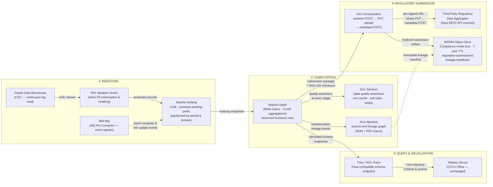

# NexusOne (NX1) Regulatory Reporting Pipeline Migration — Architecture Design Memo

**Classification:** Confidential — Solutions Architecture Review Board  
**Prepared by:** Principal Solutions Architect, NexusOne  
**Version:** 1.1 — For SA Review Board  
**Client:** Tier-1 US Retail & Investment Bank, Charlotte NC  
**Program:** Basel III & CCAR Pipeline Modernization — 18-Month  
**Audience:** SA Review Board & InfoSec Guardians  
**Distribution:** Restricted — Program Principals Only  

---

## Section 1 — Executive Summary

This memo presents the proposed NexusOne (NX1) target architecture for the Bank's Basel III and CCAR regulatory reporting pipeline migration, prepared for review by the Solutions Architecture Review Board and InfoSec Guardians.

The Bank's current end-of-quarter regulatory reporting cycle spans **5 weeks** from quarter-end to final sign-off. Three compounding bottlenecks drive this latency: human-in-the-loop validation queues that hold batches for analyst sign-off before downstream stages can proceed; slow HDFS disk I/O and MapReduce job scheduling overhead; and sequential batch dependencies that cannot exploit the fact that over 90% of the quarter's transaction data is already present days before quarter-end.

The proposed NX1 architecture compresses this cycle to **3 weeks** — a **40% reduction**. The saving is engineered, not aspirational: continuous CDC ingestion pre-stages and pre-calculates data throughout the quarter; Trino interactive queries replace hour-long Hive scan jobs for analyst validation; and automated NX1 Sentinel quality assertions replace manual sign-off gates. The residual 3-week window covers regulated parallel-run validation and final regulatory submission — a floor that cannot be compressed below the Fed/OCC submission calendar.

> **Program Target:** Full production migration, dual-run validation, and legacy Hadoop and Informatica PowerCenter decommission completed within 18 months, with no disruption to the existing Tableau reporting layer used by the CFO's office.

---

## Section 2 — Hard Constraints & Non-Negotiables

The following constraints are treated as absolute design boundaries. No phase of this program is permitted to breach them. Each is addressed within the proposed NX1 architecture as described in Section 3.

| Constraint | Requirement | NX1 Mechanism |
|---|---|---|
| **Hard — Zero Raw PII in Data Lake** | No raw, unmasked, or non-tokenized PII value may land on persistent object storage at any point. Column-level tokenization for identifier columns (e.g., account IDs, counterparty identifiers); column-level irreversible masking for descriptive PII columns (e.g., customer name, date of birth) — both applied inline before the first write, with no intermediate staging of raw values. | NX1 Mutation Hooks intercept every incoming record before any write to Iceberg object storage. The hook executor runs in a dedicated, isolated thread pool. A circuit breaker halts ingestion and raises an alert if hook processing latency breaches the agreed threshold, preventing unbounded accumulation of unmasked records in transit. |
| **Hard — Zero Tableau Disruption** | No breaking schema changes, workbook rewrites, column renames, or type-cast regressions at any phase. The Tableau layer is live during quarter-end cycles used by the CFO's office. | NX1 Prism endpoint presents a schema signature — column names, data types, nullable flags, and partition descriptors — identical to the legacy Hive metastore Tableau currently interrogates. Iceberg schema evolution with full backward compatibility provides a secondary safety net against upstream Oracle schema changes propagating to Tableau. |
| **Hard — Fixed Aggregator API Contract** | Egress to the third-party regulatory data aggregator must conform to their fixed REST API contract. NX1 does not control or modify the external contract. The contract requires: (a) a POST to fetch a session-scoped pre-signed upload URL; (b) a binary PUT of the submission package to that URL; (c) a metadata confirmation POST with structured payload fields (entity ID, submission period, package checksum, data classification). | NX1 orchestration adapts internally to produce this output sequence. Zero changes to the external interface. The pre-signed URL pattern means submission bytes go directly to the aggregator's storage, preserving chain of custody. A versioned internal schema contract, checked into source control, absorbs future aggregator format changes without ad-hoc pipeline changes. |
| **Hard — Compliance Retention & Lineage** | Automated end-to-end data lineage (source Oracle record → every transformation → final reported figure). Immutable 7-year WORM retention on all regulatory submission artifacts and their supporting lineage manifests. Object lock must be Compliance mode — no user, including storage admins, may delete or overwrite before the retention period expires. | NX1 Manifest for end-to-end lineage tracking and auditor-consumable export (structured JSON and human-readable PDF — subject to GA confirmation per Section 7, item 4). Compliance-mode object lock on dedicated WORM archive prefixes (`regulatory-submissions` and `lineage-manifests`). Two-prefix topology isolates WORM archive prefixes from Iceberg maintenance operations. |
| **Hard — 18-Month Program Window** | Full production migration, dual-run validation, and legacy Hadoop and Informatica PowerCenter decommission complete within 18 months. | Four-phase execution plan with defined, non-negotiable gate exit criteria. See Section 6. |

---

## Section 3 — Proposed NX1 Architecture

### 3.1 Current-State Footprint

| Component | Role | Migration Disposition |
|---|---|---|
| **Oracle Data Warehouse** | Source of record — regulatory & compliance datamart for Basel III RWA and CCAR scenario data | Retained. CDC reads continuously from Oracle transaction log. |
| **IBM MQ** | Operational event backbone — batch-complete triggers, risk-update pushes, system notifications. Not a bulk data transport. | Retained. Events consumed by NX1 IBM MQ HA Connector. |
| **Informatica PowerCenter** | Scheduled batch extraction from Oracle; on-prem PII tokenization & masking; HDFS load. | **Decommissioned at M18, concurrent with Hadoop.** Continues as the authoritative HDFS writer for the legacy pipeline through the Phase 4 dual-run period. PII protection role transitions to NX1 Mutation Hooks in shadow certification from M4; Informatica remains the live production PII mechanism until M18 joint decommission. Contract amendment for original M9 term — see Section 7, item 9. |
| **Apache Hadoop / HDFS + Hive** | Bulk staging; MapReduce RWA calculations; CCAR aggregations; Hive query layer for Tableau. | **Decommissioned at M18.** Replaced by Apache Iceberg + Apache Spark + NX1 Prism. |
| **Tableau Server** | CFO's office and analyst reporting layer — regulatory validation and executive dashboards. | Retained, untouched. Re-pointed to NX1 Prism endpoint. No workbook edits required. |

#### Current-State Data Flow

```mermaid
flowchart LR
    %% ── INGESTION (batch, end-of-quarter) ───────────────────
    subgraph INGEST["① INGESTION  ⚠ end-of-quarter batch accumulation"]
        direction TB
        ORA["Oracle Data Warehouse\n(Basel III RWA · CCAR scenario data)"]
        MQ["IBM MQ\n(event signals — not bulk data)"]
        INFO["Informatica PowerCenter\n(scheduled batch extraction\non-prem PII tokenization & masking)"]
        HDFS["Apache Hadoop / HDFS\n(bulk staging)"]

        ORA -->|"scheduled batch\nextract — quarter-end"| INFO
        INFO -->|"PII-protected\nbatch load"| HDFS
        MQ -.->|"batch-complete trigger\n→ Informatica job"| INFO
    end

    %% ── COMPUTATION (MapReduce, slow I/O) ────────────────────
    subgraph COMPUTE["② COMPUTATION  ⚠ slow HDFS I/O & MapReduce overhead"]
        direction TB
        MR["MapReduce Jobs\n(RWA calculations\nCCAR aggregations)"]
        GATE["⚠ Human-in-the-Loop\nValidation Queue\n(analyst sign-off gate\nbefore downstream proceeds)"]

        MR -->|"calculation\noutput"| GATE
    end

    %% ── QUERY & REPORTING ────────────────────────────────────
    subgraph REPORT["③ QUERY & REPORTING  ⚠ hour-long Hive scan jobs"]
        direction TB
        HIVE["Apache Hive\n(query layer over HDFS)"]
        TABLEAU["Tableau Server\n(CFO's Office · analyst dashboards)"]

        HIVE -->|"Hive metastore\nschema & queries"| TABLEAU
    end

    %% ── CROSS-STAGE EDGES ────────────────────────────────────
    HDFS  -->|"HDFS disk read"| MR
    GATE  -->|"signed-off batch\nreleased downstream"| HIVE
```

> **Bottlenecks driving the 5-week cycle:** ⚠ marks the three compounding constraints — end-of-quarter batch accumulation, slow HDFS I/O and MapReduce job scheduling overhead, and sequential human-in-the-loop sign-off gates that block each downstream stage until an analyst manually approves.

### 3.2 End-to-End Data Flow — Visual Summary

The target-state pipeline flows through four stages: Ingestion (Section 3.3) → Computation (Section 3.4) → Query & Visualization (Section 3.5) → Regulatory Submission (Section 3.6).

### 3.3 Ingestion Path

1. **Oracle CDC → NX1 Ingestion Plane.** Change Data Capture reads the Oracle Data Warehouse transaction log continuously, streaming incremental changes throughout the quarter. This keeps the NX1 data lake current at all times and eliminates the end-of-quarter batch accumulation that drives the 5-week cycle in the current state.

2. **IBM MQ → NX1 IBM MQ HA Connector.** Operational event signals from IBM MQ (batch-complete triggers, risk-update pushes) are consumed by the NX1 HA Connector and routed into the NX1 event stream. This eliminates polling and ensures dependent pipeline stages trigger deterministically. IBM MQ in this environment is an operational event-signalling backbone — not a bulk data transport (see Assumption A1 in Section 4).

3. **NX1 Mutation Hooks — inline PII protection.** Before any data touches persistent storage, NX1 Mutation Hooks intercept every incoming record and apply: (a) column-level tokenization to identifier columns that must retain referential integrity across tables (e.g., account IDs, counterparty identifiers); and (b) column-level irreversible masking to descriptive PII columns carrying no analytical value downstream (e.g., customer name, date of birth). No raw PII value is written to object storage at any point.

   The hook executor runs in a dedicated, isolated thread pool with reserved CPU allocation — it does not compete for compute with the CDC reader or the Iceberg writer. A circuit breaker halts CDC reader progress and triggers an operational alert if hook processing latency breaches the agreed SLA threshold, preventing unbounded accumulation of unmasked records in transit. This safety mechanism is a prerequisite for InfoSec sign-off and is subject to throughput certification prior to Gate 1 (see Section 7, item 1).

4. **Apache Iceberg Object Storage — working prefix.** Protected records land in NX1-managed object storage formatted as Apache Iceberg tables, partitioned by reporting period (quarter-end date) and data domain (Basel III capital / CCAR scenario). Copy-on-Write (CoW) mode is used — producing fully self-contained, immutable snapshot files that are the cleanest pattern for WORM compliance and point-in-time audit recall. Active ingestion and computation tables live under an *unlocked* working prefix to permit routine Iceberg maintenance operations (see WORM topology note in Section 3.7).

### 3.4 Computation Path

5. **Apache Spark — RWA & CCAR calculations.** Decoupled Spark jobs perform Basel III RWA calculation chains (credit risk, market risk, operational risk weightings) and CCAR scenario-based stress projection aggregations against the Iceberg tables. Business rules are managed as versioned, code-controlled configuration artifacts — not embedded in Hive scripts — satisfying change-control requirements. Because data is continuously pre-staged throughout the quarter, Spark jobs run progressively rather than in a single end-of-quarter burst. This is the primary mechanism for compressing the reporting cycle.

6. **NX1 Sentinel (data quality) & NX1 Manifest (lineage).** These are distinct engines with distinct responsibilities. NX1 **Sentinel** enforces automated data quality assertions at each pipeline stage: row count reconciliation, null rate checks, and aggregate total cross-checks against Oracle source records — replacing the manual human-in-the-loop validation queues in the current process. NX1 **Manifest** captures end-to-end lineage for every transformation, producing a machine-readable and human-auditable graph from source Oracle record → CDC event → Iceberg table version → Spark calculation → reported figure. Manifest exports lineage in structured JSON (for programmatic audit queries by the Bank's audit function) and human-readable PDF (for submission to Fed/OCC examiners) — subject to GA confirmation per Section 7, item 4.

### 3.5 Query & Visualization Path

7. **Trino / NX1 Prism Endpoint → Tableau.** The NX1 Prism endpoint is a Trino-compatible query abstraction that presents a schema signature — column names, data types, nullable flags, and partition descriptors — identical to the legacy Hive metastore that Tableau Server currently interrogates. Tableau's connection or extract refresh configuration is re-pointed at the NX1 Prism connection alias. No workbook edits, no column renames, no recalculations are required. Financial analysts and the CFO's office experience no visible change. This guarantee is contingent on DDL compatibility certification against the Bank's specific Tableau Server version prior to the M10 cutover (see Section 7, item 3).

### 3.6 Regulatory Submission Path

8. **Spark → Submission Package Assembly.** At the close of the regulated calculation cycle, a Spark job produces the final submission artifact (structured Parquet or schema-compliant CSV as required by the aggregator contract) and computes a SHA-256 checksum. The assembly job is built against a versioned internal schema contract — a machine-readable schema definition (JSON Schema or Avro IDL) owned jointly by the Bank's integration team and NX1, checked into source control, and used to validate the output package before transmission. This versioned contract is the change surface that absorbs any future aggregator format updates without requiring ad-hoc pipeline modifications.

9. **NX1 Orchestration → Third-Party Aggregator REST API.** NX1 orchestration calls the aggregator's fixed REST API in the required sequence: (a) POST to the session endpoint to receive the pre-signed upload URL; (b) PUT the submission package binary to the pre-signed URL; (c) POST the structured metadata confirmation payload (entity ID, submission period, package checksum, data classification). The external API contract is consumed as-is — zero changes to the external interface. The pre-signed URL pattern ensures submission bytes travel directly to the aggregator's storage, preserving chain of custody without routing through any NX1 intermediate layer.

### 3.7 Governance & Security Envelope

- **Identity & Access Management:** Native integration with the Bank's central Okta (OIDC/SAML) identity provider for all user authentication and RBAC group mapping across the NX1 plane.
- **Workload Security:** Service accounts use OIDC Workload Identity Federation (or SPIFFE/SVID) to obtain short-lived, cryptographically bound tokens scoped to specific NX1 job contexts, with a maximum TTL of 1 hour. This limits blast radius if an automated job credential is compromised.
- **PII Protection:** NX1 Mutation Hooks enforce column-level tokenization on identifier columns and column-level irreversible masking on descriptive PII columns, applied before any write to persistent storage. NX1 Mutation Hooks run in parallel shadow certification mode alongside Informatica from M4, validating 100% column-level PII output equivalence throughout the shadow period against the Informatica PII column map delivered at Gate 1. Informatica remains the live production PII mechanism until M18 joint decommission, at which point NX1 Mutation Hooks become the sole PII protection mechanism.
- **Parallel Operation Governance Boundary (M4–M18):** From M4 onward, NX1/Iceberg is the authoritative store for all NX1 pipeline consumers; Informatica/HDFS remains the authoritative store for all legacy pipeline consumers. No consumer reads from both stores simultaneously. This boundary is enforced at the query layer: NX1 Prism serves NX1 consumers; Hive metastore serves legacy consumers. After Tableau is re-pointed to NX1 Prism at the Phase 3 cutover, the Hive metastore path is retired as a consumer-facing endpoint — while the Hadoop compute environment remains live and continues to receive data from Informatica for the Phase 4 dual-run through M18. This governance boundary must be documented in the operational runbook and signed off before M4 ingestion activation.
- **WORM Retention & Two-Prefix Topology:** Compliance-mode object lock (7-year TTL) applies exclusively to the `regulatory-submissions` and `lineage-manifests` prefixes, which receive finalized, immutable artifacts only. All active ingestion tables, working computation partitions, and Iceberg metadata files live under a separate unlocked working prefix. This two-prefix topology is mandatory: Iceberg's routine maintenance operations (`expire_snapshots`, `remove_orphan_files`, `rewrite_data_files`) issue `DeleteObject` calls that Compliance-mode lock returns as `AccessDenied` — running maintenance against the WORM archive prefix leaves Iceberg metadata in an inconsistent state. The topology design requires InfoSec Guardians sign-off before any storage bucket is provisioned (Gate 1 prerequisite; see Section 7, item 5).
- **Lineage & Audit:** NX1 Manifest tracks end-to-end data lineage from source Oracle record to every reported figure, with exportable audit reports in structured JSON and human-readable PDF for Fed/OCC examination cycles — subject to GA confirmation per Section 7, item 4. See Section 3.4, item 6 for the full capability description.

### 3.8 Why Apache Iceberg

Apache Iceberg replaces HDFS as the analytical storage layer for four compounding reasons specific to this regulatory context:

- **Copy-on-Write mode** produces self-contained, append-only snapshot files — cleaner for WORM enforcement and auditor review than Merge-on-Read delta chains, and directly compatible with the Compliance-mode object lock requirement.
- **Time-travel queries** allow the Bank to reconstruct the exact data state used for any prior regulatory submission, supporting audit challenges and resubmissions without restoring backups. This is a direct audit capability that cannot be replicated by the current HDFS architecture.
- **Partition evolution** allows the Bank to restructure storage partitioning by reporting period without rewriting historical data — essential as regulatory calendar requirements change across program phases.
- **Schema evolution** with full backward compatibility ensures the Trino/Prism endpoint can absorb upstream Oracle schema changes without breaking downstream Tableau — a secondary safety net for the zero-disruption guarantee.

---

## Section 4 — Design Assumptions

The following assumptions underpin the architecture. Each will be validated during the M1 discovery workstream. If any assumption is invalidated, the specified impact applies and a revised design will be brought back to the SA Review Board before Gate 1.

| # | Assumption | Basis | If Invalidated |
|---|---|---|---|
| A1 | **IBM MQ Boundary** | IBM MQ functions strictly as an operational event-signalling backbone — batch-complete triggers, risk-update pushes, system notifications. It is not used for bulk file staging or high-volume transaction streaming. | Connector architecture and throughput requirements change materially. To be validated in M1 discovery with the DBA team. |
| A2 | **Tableau Connection Mode** | Tableau dashboards query the Hive layer via Live Connection or structured extract refresh — not via embedded direct JDBC with custom Hive-specific SQL functions. | If custom Hive SQL is embedded in workbooks, the Prism endpoint abstraction will be insufficient and workbook-level remediation will be required. To be validated in M1 by auditing the Tableau connection registry with the DBA team. |
| A3 | **Oracle CDC Availability** | Oracle Data Warehouse has supplemental logging enabled, or a CDC read-replica can be provisioned without disrupting the production warehouse operational SLA. | Architecture falls back to a micro-batch extraction pattern — workable but the continuous pre-staging benefit is partially reduced. To be validated in M1 with the DBA team. |

---

## Section 5 — Stakeholder Landscape

### 5.1 Bank-Side Stakeholders

> **Note:** The SA Review Board & InfoSec Guardians row below documents what is required *from* this audience as approvers within the program. This memo is addressed to them directly.

| Stakeholder | What They Own | What Is Required From Them |
|---|---|---|
| **CFO's Office & Business Partners** *(Executive Sponsors)* | Regulatory compliance outcome; executive mandate; budget authority. Focused on SLA compression and mitigating regulatory fine exposure. | Executive sponsorship letter confirming the 18-month program mandate; historical data on current SLA breach frequency and regulatory penalty exposure (quantifies the business case); approval authority at each program gate. |
| **Financial Analysts & Domain Experts** *(Consumer / UAT Owners)* | Day-to-day power users of the Tableau reporting layer. Define what "correct" means for RWA and CCAR output figures. Own UAT sign-off on data parity. | Documented sign-off criteria for parallel run reconciliation — specifically the acceptable aggregate variance threshold; UAT participation during M10–M14; catalogue of every Tableau workbook and calculated field that must remain bit-for-bit identical after the Prism cutover. |
| **Application Development & DBA Teams** *(Technical Partners)* | System maintainers of Oracle Data Warehouse and Informatica estate. Control Oracle CDC read-replica configuration. Own Tableau server administration. | Oracle CDC read-replica provisioning — **critical path for M1–M3**; Informatica job inventory and PII column mapping documentation (to verify NX1 Mutation Hooks cover every protected column); Tableau server schema documentation and connection string registry; contractual agreement on Informatica decommission date — to be confirmed as M18 joint decommission per revised architecture, contract amendment for original M9 term required (see Section 7, item 9). |
| **SA Review Board & InfoSec Guardians** *(Approvers)* | Enterprise security approval; network topology sign-off; compliance framework alignment; TCO reduction validation. | Network topology approval and firewall rule sign-off (prerequisite to M4 ingestion activation); two-prefix WORM topology design review and sign-off before any storage bucket is provisioned; pen-test scheduling for the NX1 connectivity boundaries; formal security review of OIDC workload token scoping. |
| **Aggregator Contract Owner** *(Integration Lead — to be named in M1)* | Monitoring of third-party aggregator release notes and change notifications for the regulatory submission API contract. Single point of contact when the aggregator changes its expected submission format. | Formal appointment confirmed in M1; subscribed to aggregator change notification channels; committed to a minimum 6-week lead-time notice before the next submission cycle when a format change is detected. Without a named owner, aggregator contract changes go undetected until a submission is rejected at the aggregator boundary — in a regulatory filing context, a rejected submission is equivalent to a missed filing deadline. |

### 5.2 Approach to Competing Priorities

This program involves stakeholders with materially different incentive structures. The engagement sequence is deliberate:

- **DBA resistance to CDC provisioning** is anticipated — Oracle supplemental logging adds licensing and operational overhead. The framing is that a CDC read-replica carries zero risk to the production warehouse. This conversation starts on Day 1, run in parallel with the InfoSec network approval track — not after it.
- **InfoSec will run on an independent approval timeline** from the DBA track. Both workstreams must be parallel from Day 1 with separate RACI owners. InfoSec approval is treated as a hard gate for M3→M4, not a sequential blocker. The CFO's Office mandate is the leverage point: each month of delay is a further month of SLA breach exposure.
- **Financial Analysts are natural allies.** Engaging them early — giving them ownership of the parallel-run parity criteria and UAT sign-off process in M1 — transforms them from passive recipients of a migration into active co-designers. This materially reduces friction at the M10–M14 Tableau cutover gate.
- **The Aggregator Contract Owner appointment must happen in M1**, not at the point of integration build. Leaving this role unfilled is an unmonitored risk of submission rejection with no early warning mechanism.

---

## Section 6 — 18-Month Execution Plan

> Gate exit criteria are hard conditions — not targets. No phase may proceed until its gate is fully satisfied and signed off by the designated approvers.

### Phase 1 — Foundation, Discovery & Governance Setup — Months 1–3

**Goal:** Establish all prerequisites so ingestion pipeline activation in M4 has no blockers.

- Activate network topologies, firewall rules, and VPN/private connectivity between the Bank's on-prem environment and the NX1 software plane — pending InfoSec Review Board approval.
- Design and obtain InfoSec Guardians sign-off on the two-prefix storage topology (unlocked working prefix + WORM archive prefix) before any storage buckets are provisioned — Gate 1 prerequisite.
- Configure object storage buckets with Compliance-mode object lock on the `regulatory-submissions` and `lineage-manifests` prefixes (7-year TTL); leave working and ingestion prefixes unlocked for Iceberg maintenance.
- Stand up the core NX1 software plane integrated with the Bank's Okta directory for RBAC group mapping and OIDC workload identity federation.
- **Discovery workstream (parallel):** Audit Oracle CDC availability with DBA team; catalogue all Tableau workbooks and connection strings; document Informatica PII column mapping inventory; confirm IBM MQ throughput profile; confirm Aggregator Contract Owner appointment; agree Informatica decommission date as M18 joint decommission per revised architecture — contract amendment for original M9 term required, see Section 7, item 9.

> **Critical Dependencies — Phase 1:** Two workstreams must run in parallel and cannot be sequential: (1) InfoSec network topology approval — hard gate for M3→M4, controls when ingestion can activate; (2) DBA team Oracle CDC read-replica provisioning — also on the critical path for M4. Both must be tracked with separate RACI owners from Day 1.

#### Gate 1 (M3 exit)
- InfoSec network approval signed off
- Two-prefix storage topology reviewed and signed off by InfoSec
- Object storage buckets provisioned with correct lock configuration
- Oracle CDC read-replica provisioned
- IBM MQ throughput profile documented
- Informatica PII column map delivered
- Aggregator Contract Owner named
- Informatica M18 joint decommission date agreed — contract amendment for original M9 term confirmed per Section 7, item 9

---

### Phase 2 — Ingestion Pipeline Build, PII Handover & Shadow Calculations — Months 4–9

**Goal:** Full CDC ingestion running, NX1 Mutation Hooks certified as PII-equivalent in shadow mode alongside Informatica, and three quarters of shadow calculation parity evidence accumulated.

- Deploy the enterprise-grade NX1 IBM MQ HA Connector (required GA before this phase begins — see Section 7, item 2).
- Activate Oracle CDC ingestion into NX1 Mutation Hooks → Iceberg. Both NX1 CDC and Informatica operate in parallel from M4 — Informatica continues as the live production PII mechanism and authoritative HDFS writer; NX1 Mutation Hooks run in shadow certification mode throughout Phase 2 and Phase 3 with no live switchover until M18.
- Run NX1 Mutation Hooks in continuous shadow mode against Informatica's PII protection output — confirm 100% column-level output equivalence across every column in the Informatica PII column map (delivered at Gate 1). Shadow parity evidence accumulates throughout Phase 2 and is carried into Phase 3; no decommission proceeds without full equivalence sign-off by the Bank's DBA team and InfoSec Guardians.
- Activate Spark shadow calculation jobs for RWA chains and CCAR scenario aggregations, running quarterly outputs in parallel with legacy Hadoop MapReduce jobs.
- NX1 Sentinel data quality assertions active at every pipeline stage — row counts, null rates, aggregate totals — with automated alerting on variance.

> **Parallel Operation Governance Boundary:** Active from M4 ingestion activation. NX1/Iceberg is authoritative for NX1 consumers; Informatica/HDFS is authoritative for legacy consumers. No consumer reads from both stores simultaneously. This boundary must be documented in the operational runbook and signed off by the Bank's DBA team and InfoSec Guardians before M4. See Section 3.7 for the full governance boundary definition.

- Begin structured enablement program for DBA and AppDev teams on Spark, Trino, and Iceberg operational tooling. This must run in parallel with the build phases — not deferred to post-delivery.

#### Gate 2 (M9 exit)
- Two consecutive quarterly Spark shadow runs showing ≤0.01% aggregate variance against Hadoop MapReduce outputs, validated and signed off by the Bank's Risk function. A third shadow run must complete by M12 as a Phase 3 entry condition — all three runs must be signed off before Gate 3.
- NX1 Mutation Hooks shadow parity evidence documented across both completed quarterly cycles and signed off by the Bank's DBA team and InfoSec Guardians
- IBM MQ HA Connector sustained at peak throughput for 30 consecutive days

---

### Phase 3 — NX1 Prism Activation & Zero-Disruption Tableau Cutover — Months 10–14

**Goal:** Tableau seamlessly re-pointed to NX1 Prism with zero analyst-visible disruption; regulatory aggregator integration live in staging.

- Expose the NX1 Prism Trino-compatible endpoint with a schema signature certified against the legacy Hive metastore DDL for the Bank's specific Tableau Server version.
- Re-point Tableau Server connection aliases to the NX1 Prism endpoint — no workbook edits, no schema changes. Financial Analyst UAT team validates every dashboard and calculated field against sign-off criteria defined in M1.
- Stand up the regulatory aggregator integration in staging: Spark submission package assembly → NX1 orchestration → REST API call sequence (pre-signed URL fetch → PUT upload → metadata POST). End-to-end tested against the aggregator's staging environment.
- Continue and complete the structured enablement program for DBA and AppDev teams.

#### Gate 3 (M14 exit)
- All three consecutive quarterly Spark shadow runs at ≤0.01% aggregate variance signed off by the Bank's Risk function (third run must complete by M12 — prerequisite for this gate)
- Financial Analyst UAT sign-off on all Tableau dashboards
- Regulatory aggregator end-to-end integration test passed in staging
- Bank DBA team certified on NX1 operational procedures

---

### Phase 4 — Dual-Run, Production Handover & Hadoop Decommission — Months 15–18

**Goal:** Prove absolute parity across live production quarter-end close cycles, transfer operational ownership, decommission legacy Hadoop and Informatica PowerCenter in a single coordinated event.

- Execute a minimum of **two complete live quarter-end close cycles** concurrently on both the legacy Hadoop environment and the NX1 environment. Three cycles preferred if the Fed/OCC regulatory calendar permits within the window.
- Produce formal parity reports for each dual-run cycle — mathematical equivalence of RWA calculations, CCAR scenario outputs, and submission package contents — reviewed and signed off by the Bank's Risk and Audit committees.
- Transfer operational ownership of NX1 to the Bank's DBA and AppDev teams. NX1 SA remains on embedded support through final Hadoop decommission.
- Decommission Informatica PowerCenter and legacy Hadoop cluster together after the final dual-run cycle receives Risk and Audit sign-off — both legacy components exit in a single coordinated decommission event, eliminating any risk of partial decommission leaving the legacy pipeline in an inconsistent state.
- NX1 Manifest lineage export used to produce the first full audit-ready lineage report for the Fed/OCC submission record.

> **Regulatory Calendar Dependency:** The dual-run in M15–M18 must be sequenced to capture at least one live quarter-end close cycle on the NX1 environment before Hadoop decommission. This program must be calendared against the Federal Reserve's actual reporting cycle — not a generic 18-month timeline. Alignment of the M15–M18 window with the next available quarter-end close cycle must be confirmed before Gate 3 (M14 exit).

#### Gate 4 (M18 exit)
- Minimum two live quarter-end dual-run cycles with Risk and Audit sign-off on parity reports
- Legacy Hadoop cluster decommissioned
- Informatica PowerCenter decommissioned
- Operational ownership formally transferred to the Bank's DBA and AppDev teams
- First Fed/OCC audit-ready lineage report produced and filed

---

## Section 7 — Open Items & Prerequisites for Design Sign-Off

The following items must be resolved or formally risk-accepted before this design can be signed off. Each has a designated owner and resolution timeline.

| # | Item | Owner | Required By |
|---|---|---|---|
| 1 | NX1 Mutation Hooks throughput benchmark confirming sub-10ms per-record PII protection latency at ≥50K records/sec sustained ingestion (estimated Oracle CDC peak rate), with demonstrated hook executor CPU isolation and circuit breaker behavior under 2× peak load. | NX1 Engineering | Before SA Review Board presentation (Gate 1, M3 exit) |
| 2 | IBM MQ HA Connector enterprise-grade release: transactional checkpoint tracking with persistent offset storage, exactly-once delivery semantics, automated DLQ failover with alerting, and tested behavior at 2× Bank peak MQ throughput. If GA slips past M4, the entire ingestion activation phase shifts right and the M15–M18 dual-run window is at risk. | NX1 Engineering / Product | Before Phase 2 start (M4) |
| 3 | NX1 Prism endpoint DDL compatibility certification against the Bank's Tableau Server version (to be confirmed in M1). Any type drift — including implicit INT32/INT64 mismatches — will silently break Tableau calculated fields and produce incorrect regulatory figures without surfacing an error. | NX1 Engineering | Prior to M10 Tableau cutover |
| 4 | NX1 Manifest lineage export capability confirmed GA in both structured JSON (with documented public schema) and human-readable PDF formats. If not currently GA, a committed roadmap delivery date before M10 is required. Without this, the compliance mandate for Fed/OCC audit examinations cannot be satisfied and the design cannot be signed off. | NX1 Product | Roadmap commitment before SA Review Board sign-off; GA before M10 |
| 5 | Two-prefix storage topology design — specifying per-prefix Iceberg table configurations, the post-submission promotion job, and explicit disabling of all Iceberg maintenance on the WORM archive prefix — reviewed and signed off by InfoSec before any storage bucket is provisioned. | InfoSec Guardians / NX1 SA | Gate 1 (M3 exit) |
| 6 | Aggregator Contract Owner appointment confirmed by name in M1, with formal subscription to aggregator change notification channels and commitment to a minimum 6-week lead-time notice to NX1 Engineering when a format change is detected. A rejected regulatory submission due to an undetected contract change is equivalent to a missed filing deadline. | Bank Integration Lead | M1 (pre-Gate 1) |
| 7 | Informatica PowerCenter decommission date agreed as M18 joint decommission with Hadoop. Informatica continues as the authoritative HDFS writer and live production PII mechanism through the Phase 4 dual-run period — this is a deliberate design decision, not a deferral. Parallel operation from M4 to M18 is governed by the data governance boundary defined in Section 3.7. The contractual amendment to the original M9 term is addressed separately in item 9. | Bank DBA Team / NX1 SA | Decommission complete by end of M18, concurrent with Hadoop |
| 8 | Bank DBA and AppDev team enablement program confirmed as a parallel workstream starting in M4. These teams have no current familiarity with Spark, Trino, or Iceberg. If enablement is deferred to post-delivery, the M15–M18 operational handover cannot proceed and the dual-run cannot transition to full Bank ownership. | NX1 SA / Bank AppDev Lead | Program confirmed by Phase 2 start (M4); completion by Gate 3 (M14 exit) |
| 9 | **Informatica Decommission Contract Term — Scope Change.** The architectural decision to defer Informatica PowerCenter decommission from M9 to M18 (joint decommission with Hadoop) requires formal agreement with the Bank's DBA team to amend the contractual term agreed in M1. Rationale: preserving Informatica as the live production PII mechanism and authoritative HDFS writer through the Phase 4 dual-run period eliminates three critical architectural loopholes — the Phase 4 dual-run HDFS data gap, the impossible Gate 2 three-quarter shadow run calendar, and the unquantified PII switchover window. This amendment must be agreed before Phase 2 build begins. If the Bank's DBA team declines the amendment, the original M9 contractual term stands and the three loopholes must be resolved by alternative mechanisms, which requires a revised design to be brought back to the SA Review Board before Gate 1. | NX1 SA / Bank DBA Lead | Contract amendment confirmed by Gate 1 (M3 exit) |
